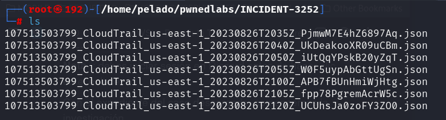

This lab demonstrates the use of AWS CloudTrail logs to detect malicious activity as well as S3 enumeration. To begin, download the CloudTrail logs in `INCIDENT-3252.zip` from the 🔎-case-files channel on Pwned Labs Discord: [https://discord.gg/pwnedlabs](https://discord.gg/pwnedlabs)

## Scenario

We have been alerted to a potential security incident. Huge Logistics' security team has provided you with AWS keys for an account that recorded unusual activity, along with AWS CloudTrail logs from the time of the activity. We need your expertise to confirm the breach by analyzing our CloudTrail logs, identifying the compromised AWS service, and uncovering any data that may have been leaked.

# Real-World Context

Analyzing AWS CloudTrail logs is a standard practice for detecting suspicious activity within an AWS account, while attackers often target S3 buckets due to the valuable data they may contain.

## **Tutorial**

To begin, download the CloudTrail logs `INCIDENT-3252.zip` from the case-files channel on Pwned Labs [Discord](https://discord.gg/pwnedlabs). Once the case file is downloaded, let's begin the investigation.

First, unzip the file using `unzip`.

```
unzip INCIDENT-3252.zip -d INCIDENT-3252
cd INCIDENT-3252
```



Opening the file in a text editor like Nano or Vim reveals that the JSON files are unformatted, which makes them harder to read. To beautify the files, we can use `jq` — a command-line JSON processor for analyzing and structuring data. Install it if necessary with the command `apt install jq`. Then run the following command in the current directory containing the JSON files.


```bash
for file in *.json; do jq . "$file" > "$file.tmp" && mv "$file.tmp" "$file"; done
```

When opening the file in nano, the data is now much easier to read and scan.


Let's check which AWS Principals (IAM users and roles) have been generating activity in the captured logs.


This reveals the suspicious username `temp-user`, which does not match the internal naming convention for created accounts. Let's start there.

We notice that CloudTrail logs contain the creation time in the file name and are ordered by time. The earliest moment is `T2035`, so let's begin there. We suspect that the `temp-user` account is involved, and we’ll grep the file with `temp-user` as the search term.

```bash
grep -h -A 10 temp-user 107513503799_CloudTrail_us-east-1_20230826T2035Z_PjmwM7E4hZ6897Aq.json
```


This reveals that an IAM user named `temp-user` with the unique ARN (Amazon Resource Name) `arn:aws:iam::107513503799:user/temp-user` from the AWS account `107513503799` issued the `aws sts get-caller-identity` CLI command at `2023-08-26T20:29:37Z`. 

The `GetCallerIdentity` action in AWS is part of the [Security Token Service (STS)](https://docs.aws.amazon.com/STS/latest/APIReference/welcome.html) and allows users to retrieve details about the IAM identity whose credentials are being used to make the API request. It is somewhat like the `whoami` command for Windows and Linux. The command returns the globally unique ARN, and if applicable, the ARN of the assumed IAM role. While this is a common command, malicious actors also use it to determine the IAM principal (user or role) associated with compromised credentials, as part of their reconnaissance efforts.

The request originated from the IP address `84.32.71.19`. A lookup reveals that the request came from Chicago, US. This is not a country where Huge Logistics has a technical presence, which makes this a potential Indicator of Compromise (IoC). Let’s dive deeper.


Turning our attention to the next file, a quick look reveals that the `temp-user` account made a failed attempt to enumerate the contents of a bucket called `emergency-data-recovery`.

```bash
nano 107513503799_CloudTrail_us-east-1_20230826T2040Z_UkDeakooXR09uCBm.json
```


The investigation of the next file reveals many errors. The `errorMessage` value shows that `temp-user` made numerous requests to other AWS services.


While this is noisy, malicious actors may attempt to brute force IAM permissions granted to their user or role. There are several tools available for brute-forcing IAM permissions, such as [aws-enumerator](https://github.com/shabarkin/aws-enumerator) and [pacu](https://github.com/RhinoSecurityLabs/pacu). We found that 450 "Access Denied" messages were generated by `temp-user` in the following log file.


Upon analyzing the next log file and searching again for actions invoked by the user, we see that they were able to assume a role named `AdminRole`. The `AssumeRole` operation in AWS is part of STS. It allows an AWS identity to assume a different privilege context for a limited time and potentially access other resources that the assumed principal would not normally have access to.


Reviewing the next file reveals that the attacker invoked the `aws sts get-caller-identity` command again to verify their new execution context.

```bash
grep -A 20 AdminRole 107513503799_CloudTrail_us-east-1_20230826T2105Z_fpp78PgremAcrW5c.json
```


Noting their previous interest in the `emergency-data-recovery` S3 bucket, we find that they tried again to enumerate and retrieve the contents.

```bash
grep eventName 107513503799_CloudTrail_us-east-1_20230826T2120Z_UCUhsJa0zoFY3ZO0.json
```


```bash
grep -A 20 ListObjects 107513503799_CloudTrail_us-east-1_20230826T2120Z_UCUhsJa0zoFY3ZO0.json
```


```bash
grep -A 20 GetObject 107513503799_CloudTrail_us-east-1_20230826T2120Z_UCUhsJa0zoFY3ZO0.json
```


## **Retracing the Attacker's Steps**

Now, thinking like an attacker, we want to validate the exploit path and access the compromised data. We issue the `aws configure` command to set up the provided AWS keys for the user we suspect is compromised. Next, we confirm our execution context.


Let's see if there are inline user policies attached to our IAM user.

```bash
aws iam list-user-policies --user-name temp-user --profile lab
```


This reveals the policy named `test-temp-user`. Let’s check it.

```bash
aws iam get-user-policy --user-name temp-user --policy-name test-temp-user
```


This reveals that the user can assume the role named `AdminRole`.

Once the role is identified, the attacker attempted to assume it. We can do this with the following command.


To assume the role, we need to issue the `aws configure` command to use the `AccessKeyId` and `SecretAccessKey` provided in the previous step. Then issue the command `aws configure set aws_session_token "<SessionToken>"` to set the token. Once done, we can call the command `aws sts get-caller-identity` and verify our new context!


Now, we can enumerate the bucket contents and retrieve the files. The flag is located in the `emergency.txt` file.

```bash
aws s3 ls s3://emergency-data-recovery --profile lab
```


```bash
aws s3 cp s3://emergency-data-recovery/emergency.txt . --profile lab
```


---

## References

- [PwnedLabs Lab](https://pwnedlabs.io/labs/breach-in-the-cloud)
- [CloudTrail](https://docs.aws.amazon.com/awscloudtrail/latest/userguide/cloudtrail-user-guide.html)
- [STS Api Reference](https://docs.aws.amazon.com/STS/latest/APIReference/welcome.html)