 

## Scenario

We have been alerted to a potential security incident. The security team at Huge Logistics has provided AWS keys from an account that recorded unusual activity, along with AWS CloudTrail logs for the time of the activity. We need your expertise to confirm the breach by analyzing the CloudTrail logs, identifying the compromised AWS service, and any data that may have been exfiltrated.

<!-- ## Real-World Context

Analyzing AWS CloudTrail logs is a standard practice for detecting suspicious activity within an AWS account. Attackers often target S3 buckets due to the valuable data they can contain.

---

## Tutorial  

### Confirming the Breach via CloudTrail Log Analysis  

To begin, download the CloudTrail logs `INCIDENT-3252.zip` from the `case-files` channel in the Pwned Labs Discord.  

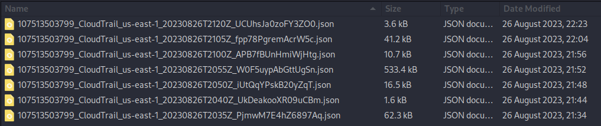  

With the case file downloaded, let’s start the investigation.  
First, unzip the file using the following commands. If you don’t have `unzip` installed, you can install it with:  

```bash
sudo apt install unzip
unzip INCIDENT-3252.zip -d INCIDENT-3252
cd INCIDENT-3252
```  

Opening the file in a text editor like Nano or Vim reveals that the JSON files are not formatted:  
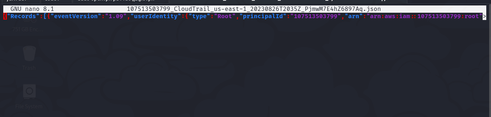  
This makes them harder to read. To format the files, we can use `jq`—a command-line JSON processor to parse and structure data. Install it with:  

```bash
sudo apt install jq
```  

Then, run the following command in the directory containing the JSON files:  

```bash
for file in *.json; do jq . "$file" > "$file.tmp" && mv "$file.tmp" "$file"; done
```  

Opening the file in Nano now shows the data in a much more readable format:  
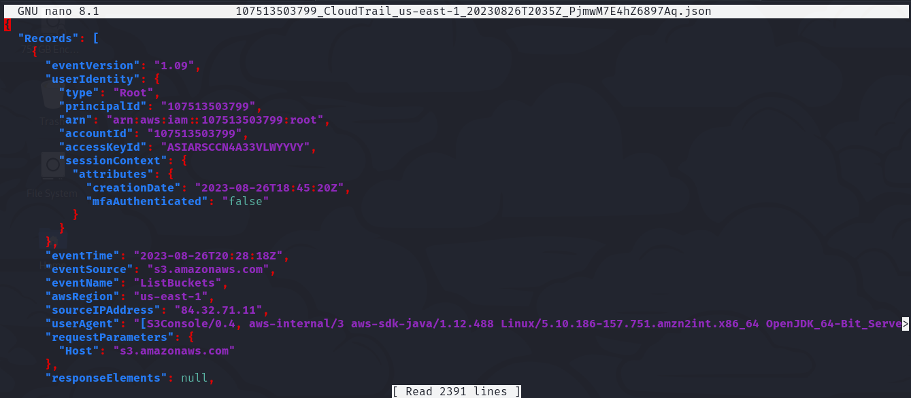  

Let’s check which AWS principals (IAM Users or Roles) have been generating activity in the captured logs:  

```bash
grep -r userName | sort -u
```  

  

This reveals a suspicious username, `temp-user`, which doesn’t match the internal naming convention for created accounts. Let’s start there.  

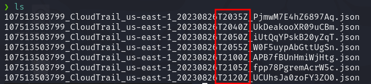  

Noticing that the CloudTrail logs include timestamps in the file names and are ordered chronologically, we begin with the earliest timestamp, `T2035`. Suspecting involvement of the `temp-user` account, we search the file using `temp-user` as the keyword:  

```bash
grep -h -A 10 temp-user 107513503799_CloudTrail_us-east-1_20230826T2035Z_PjmwM7E4hZ6897Aq.json
```  

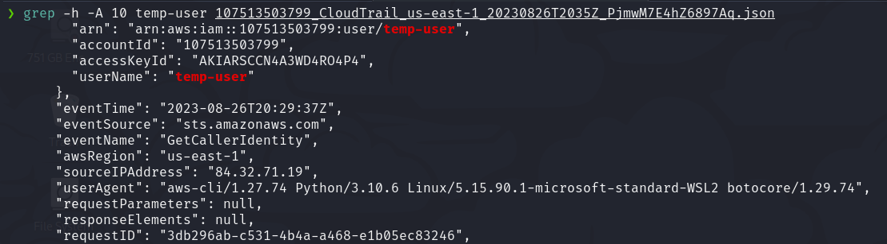  

This reveals that an IAM user named `temp-user` with the globally unique Amazon Resource Name (ARN) `arn:aws:iam::107513503799:user/temp-user` from AWS account `107513503799` issued the CLI command `aws sts get-caller-identity` at `2023-08-26T20:29:37Z`.  

The `GetCallerIdentity` command in AWS is part of the Security Token Service (STS) and allows users to retrieve details about the IAM identity whose credentials were used to make the API request.  
It’s akin to the `whoami` command for Windows and Linux. This command returns the globally unique ARN and, if applicable, the ARN of the assumed IAM Role. While it’s a commonly used command, malicious actors often use it to identify the principal (IAM User or Role) associated with compromised credentials as part of their reconnaissance.  

The request originated from IP address `84.32.71.19`. A lookup of the IP reveals that the request originated in Chicago, a city where Huge Logistics has no technical presence. This could be a potential indicator of compromise (IoC). Let’s dig deeper:  

```bash
curl ipinfo.io/84.32.71.19
```  

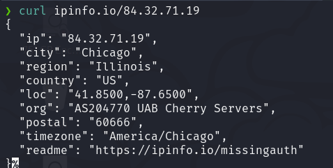  

Turning our attention to the next file, a quick look shows that the `temp-user` attempted to list the contents of a bucket named `emergency-data-recovery`, but failed.  

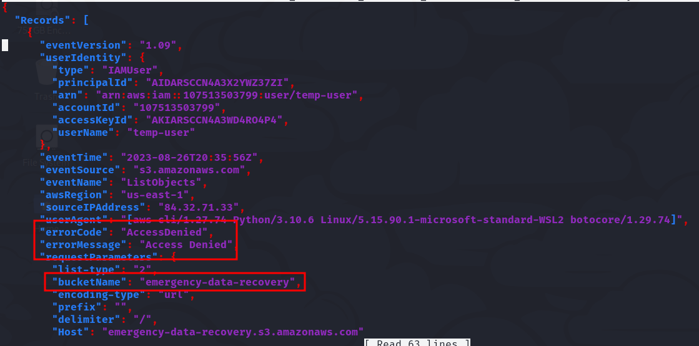  

```bash
grep errorMessage 107513503799_CloudTrail_us-east-1_20230826T2050Z_iUtQqYPskB20yZqT.json
```  

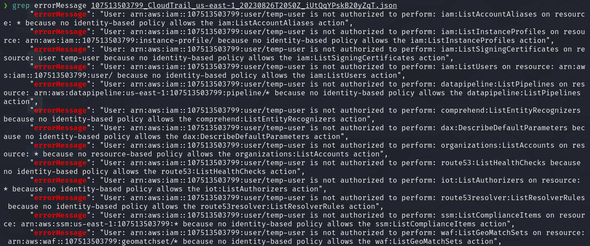  

Although noisy, malicious actors may attempt to brute force permissions granted to their IAM user or role.  
Several tools, like `aws-enumerator` and `pacu`, are available for brute-forcing IAM permissions.  

We discovered that `temp-user` generated **450 Access Denied messages** in the next log file:  

```bash
grep errorMessage 107513503799_CloudTrail_us-east-1_20230826T2050Z_iUtQqYPskB20yZqT.json | wc -l
```  

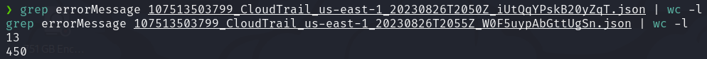  

Analyzing the next log file, we found that the attacker successfully assumed a role named `AdminRole`.  
The `AssumeRole` operation in AWS, part of STS, allows an AWS identity to assume a different privilege context for a limited period, potentially granting access to resources the original principal wouldn’t have access to.  

```bash
grep -A 20 temp-user 107513503799_CloudTrail_us-east-1_20230826T2100Z_APB7fBUnHmiWjHtg.json
```  

  

Further examination shows that the attacker used `aws sts get-caller-identity` again to verify their new execution context:  

```bash
grep -A 20 AdminRole 107513503799_CloudTrail_us-east-1_20230826T2105Z_fpp78PgremAcrW5c.json
```  

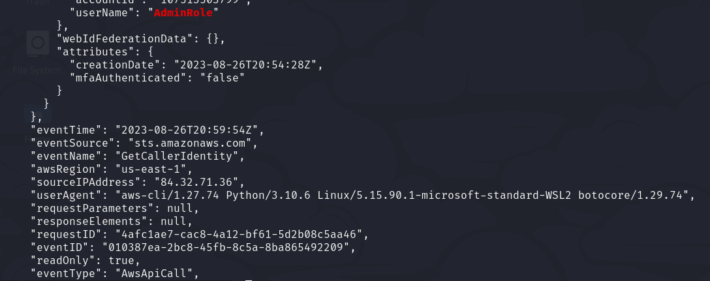  

Given their earlier interest in the `emergency-data-recovery` S3 bucket, the attacker made another attempt to list and retrieve its contents:  

```bash
grep eventName 107513503799_CloudTrail_us-east-1_20230826T2120Z_UCUhsJa0zoFY3ZO0.json
```  

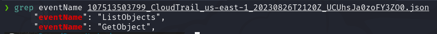  
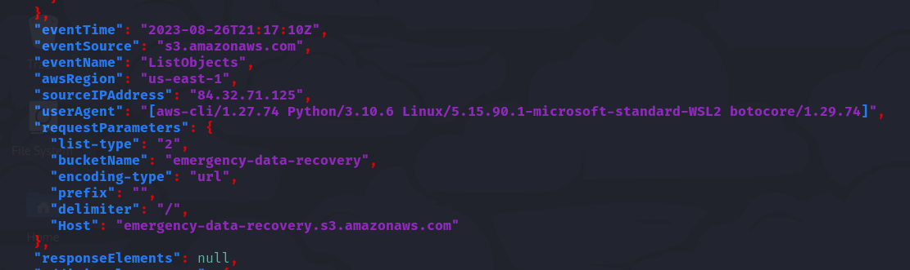  

The file `emergency.txt` was downloaded!  

---

## Referencias

- [Laboratorio en Pwed Labs](https://pwnedlabs.io/labs/breach-in-the-cloud)
- [Link 1](https://vikas-singh.notion.site/AWS-CloudTrail-Forensics-A-SIEM-Case-Study-c88ea9f7a66e4d038500dcfe28e5e53d)
- [Link 2](https://docs.aws.amazon.com/awscloudtrail/latest/userguide/cloudtrail-log-file-examples.html)
- [Link 3](https://github.com/nagwww/s3-leaks) -->

Is cooming. . . 