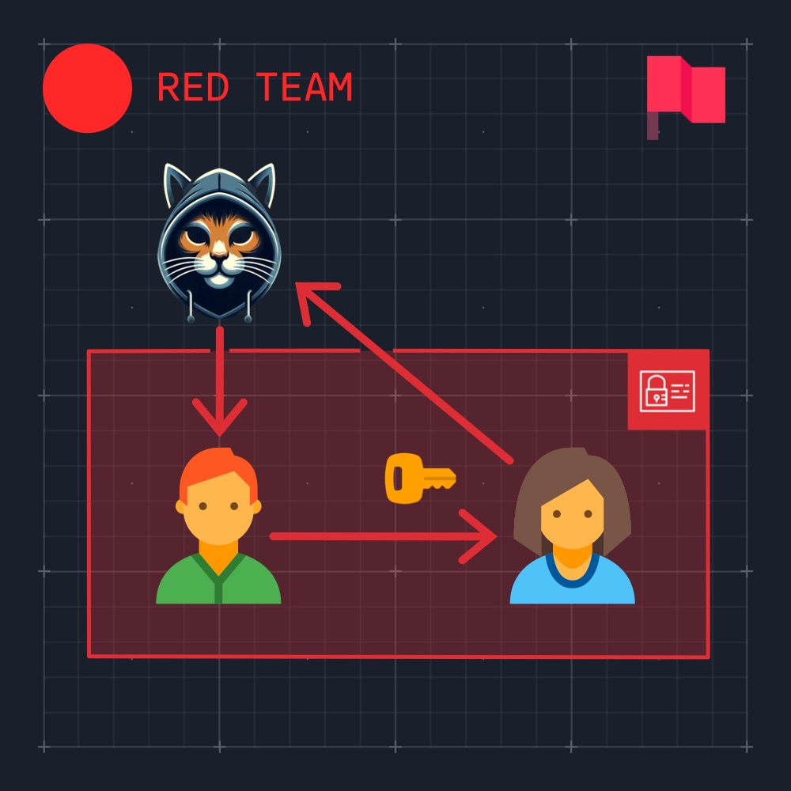
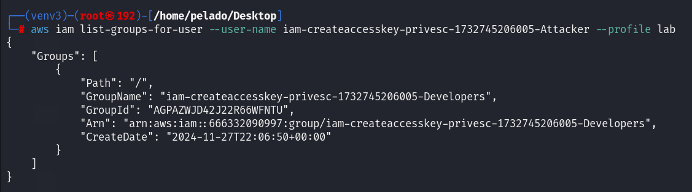
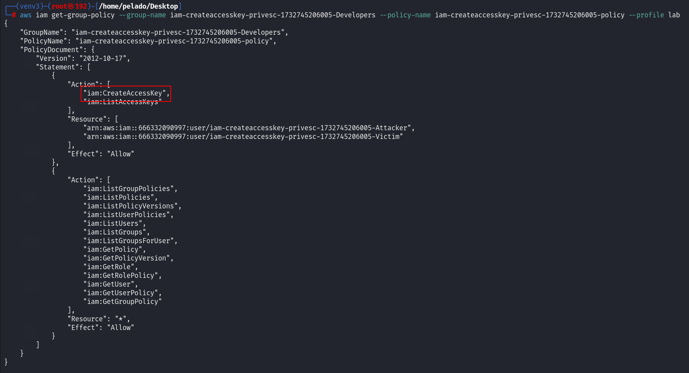
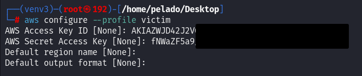

Exploit `iam:CreateAccessKey` to gain access to an Amazon S3 bucket containing sensitive data that your IAM user does not have permission to access. The flag is the credit card number of "Kayla Sánchez" found in the exfiltrated clients file.

## Scenario

Only high-level administrators should have the `iam:CreateAccessKey` permission, as an attacker with this permission for other users can create an Access Key ID and Secret Key for that user, allowing them to authenticate as that user.

Leverage the misconfigured IAM policy in this lab to escalate your privileges. This lab exercise is successfully completed once you access and download sensitive files containing customer Personally Identifiable Information (PII) from Amazon S3 and submit the credit card number of "Kayla Sánchez" from the `clients.txt` file.

## Tutorial

After configuring the AWS CLI with the provided credentials, we proceed to the enumeration phase. We start with `sts get-caller-identity` and `iam get-user` to retrieve information about our user.

  
  

Our username is `iam-createaccesskey-privesc-1732745206005-Attacker`. We enumerate other users in the account.

  

We find one additional user. After obtaining the names, we attempt to list our inline and attached policies, but we lack the required permissions. Next, we list the groups in this account.

  

There is a group named `iam-createaccesskey-privesc-1732745206005-Developers`. Listing the groups to which our user belongs, we find that we are part of this group.  

  

By listing the group’s inline policies, we retrieve the policy name. Using this, we view the policy to identify the permissions we have as a member of the `iam-createaccesskey-privesc-1732745206005-Developers` group.

  
  

One of the actions we can perform that affects the other user is `iam:create-access-key`.

If we research how to escalate privileges with `iam:CreateAccessKey`, two main resources appear: [HacktricksCloud](https://cloud.hacktricks.xyz/pentesting-cloud/aws-security/aws-privilege-escalation/aws-iam-privesc#iam-createaccesskey) and [RhinoSecurityLabs](https://rhinosecuritylabs.com/aws/aws-privilege-escalation-methods-mitigation/).

`iam:CreateAccessKey allows creating an Access Key ID and a Secret Access Key for another user, potentially leading to privilege escalation.`

```bash
aws iam create-access-key --user-name <VICTIM>
```

We proceed to execute the command, escalating privileges to the victim user.  
  

We configure the new keys we obtained.  
  

We begin the enumeration again.  
  

We list the victim user’s potential inline policies and find that they have access to a bucket, allowing us to list and retrieve its contents.  
  
  

We list the available buckets.  
  

We list the contents of the bucket.  
  

We copy and find the flag.  
  
  

----

## References
- [CloudTricks](https://cloud.hacktricks.xyz/pentesting-cloud/aws-security/aws-privilege-escalation/aws-iam-privesc)
- [RhinoSecurityLabs](https://rhinosecuritylabs.com/aws/aws-privilege-escalation-methods-mitigation/)
- [Lab](https://cybr.com/hands-on-labs/lab/iam-createaccesskey-privesc/)