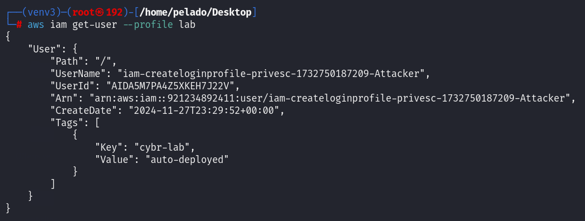
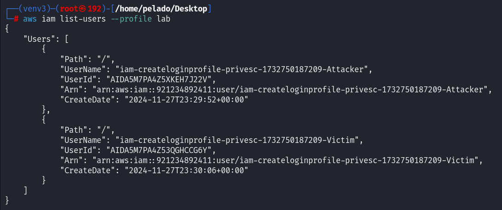

**Exploit `iam:CreateLoginProfile` to Gain Access to an Amazon S3 Bucket Containing Sensitive Data**  

The flag is the SSN number of "Holly Duncan" from the file "ssn.csv."  

---

## Scenario  

The goal of this lab is to exploit the `iam:CreateLoginProfile` vulnerability to grant yourself permissions you should not have. You successfully complete this lab once you access and download sensitive files containing customers' personally identifiable information (PII) from Amazon S3 and submit the SSN number of "Holly Duncan."  

---

## Tutorial  

After configuring the AWS CLI with the provided credentials, we begin the enumeration phase. We start with `sts get-caller-identity` and `iam get-user` to retrieve information about our user.  

  
  

Our username is `iam-createloginprofile-privesc-1732750187209-Attacker`. Next, we enumerate the other users in the account.  

  

We find one additional user. After identifying the names, we attempt to list inline and attached policies, but lack the required permissions. Instead, we list the groups in this account.  

  

We identify the group `iam-createloginprofile-privesc-1732750187209-Developers`. By listing the groups associated with our user, we confirm that we belong to this group.  

  

Listing the inline policies of the group reveals its name, allowing us to retrieve the policy and view the permissions available to members of `iam-createloginprofile-privesc-1732750187209-Developers`.  

  
  

One of the actions we can perform, which will affect the other user, is `iam:CreateLoginProfile`.  

Searching for ways to escalate privileges with `iam:CreateLoginProfile` leads to two key resources:  
- [HacktricksCloud](https://cloud.hacktricks.xyz/pentesting-cloud/aws-security/aws-privilege-escalation/aws-iam-privesc#iam-createloginprofile-or-iam-updateloginprofile)  
- [RhinoSecurityLabs](https://rhinosecuritylabs.com/aws/aws-privilege-escalation-methods-mitigation/)  

`iam:CreateLoginProfile` allows creating or updating a login profile, including setting passwords for AWS Management Console login, leading to direct privilege escalation.  

```bash
aws iam create-login-profile --user-name target_user --no-password-reset-required --password '<password>'
```  

We execute the command, specifying the victim's username and generating a password that does not require a reset upon login.  

  

We log in to the AWS Management Console with the victim's credentials, granting us read and download permissions to an S3 bucket.  

  
  
  

After downloading the files, we find the flag.  

  

---

## References  
- [CloudTricks](https://cloud.hacktricks.xyz/pentesting-cloud/aws-security/aws-privilege-escalation/aws-iam-privesc#iam-createloginprofile-or-iam-updateloginprofile)  
- [RhinoSecurityLabs](https://rhinosecuritylabs.com/aws/aws-privilege-escalation-methods-mitigation/)  
- [Lab](https://cybr.com/courses/iam-privilege-escalation-labs/lessons/lab-ctf-iamcreateloginprofile-privesc/)  