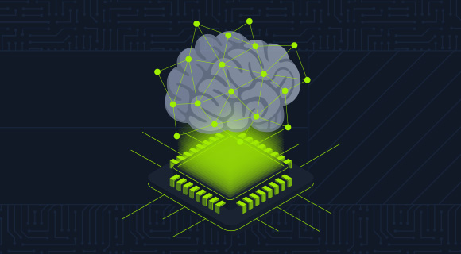

The terms Artificial Intelligence (AI) and Machine Learning (ML) are closely related, but they represent distinct concepts with specific applications and theoretical foundations.

### AI - Artificial Intelligence

AI is a broad field focused on developing intelligent systems capable of performing *tasks* that normally require human intelligence.

These tasks include:

* `Natural Language Processing`: Enabling computers to understand, interpret, and generate human language.
* `Computer Vision`: Enabling computers to “see” and interpret images and videos.
* `Robotics`: Developing robots that can perform tasks autonomously or with human guidance.
* `Expert Systems`: Creating systems that mimic the decision-making capabilities of human experts.

One of the main goals of AI is to augment human capabilities, not just replace our efforts. These systems are designed to improve decision-making and our productivity, providing support in complex data analysis, prediction, and mechanical tasks.

AI solves complex problems in various fields:

* In the [healthcare sector](https://www.youtube.com/watch?v=uvqDTbusdUU), it improves disease diagnosis and drug discovery.
* In [finance](https://youtu.be/PjSAmUMxkrs), it detects fraudulent transactions and optimizes investment strategies.
* In [cybersecurity](https://www.youtube.com/watch?v=YWGZ12ohMJU), it identifies and mitigates cyber threats.

### ML - Machine Learning

Machine Learning is a subfield of AI that focuses on enabling systems to learn from data and improve their performance on specific tasks without the need for explicit programming.

ML algorithms use statistical techniques to identify patterns, trends, and anomalies in datasets, enabling the system to make predictions, decisions, or classifications based on new input data.

ML can be classified into three main types:

* `Supervised Learning`: The algorithm learns from labeled data, where each data point is associated with a known outcome or label. Some examples include:

  * Image classification
  * Spam detection
  * Fraud prevention
* `Unsupervised Learning`: The algorithm learns from unlabeled data without being provided an outcome or label. Some examples include:

  * Customer segmentation
  * Anomaly detection
  * Dimensionality reduction
* `Reinforcement Learning`: The algorithm learns through trial and error, interacting with the environment and receiving feedback in the form of rewards or penalties. Some examples are:

  * [Game playing](https://youtu.be/DmQ4Dqxs0HI)
  * [Robotics](https://www.youtube.com/watch?v=K-wIZuAA3EY)
  * [Autonomous driving](https://www.youtube.com/watch?v=OopTOjnD3qY)

Machine Learning has a wide range of applications across various industries, including:

* `Healthcare`: Disease diagnosis, drug discovery, personalized medicine
* `Finance`: Fraud detection, risk assessment, algorithmic trading
* `Marketing`: Customer segmentation, targeted advertising, recommendation systems
* `Cybersecurity`: Threat detection, intrusion prevention, malware analysis
* `Transportation`: Traffic prediction, autonomous vehicles, route optimization

Machine Learning (ML) is a rapidly evolving field with the emergence of new algorithms, techniques, and applications. It is a key enabler of AI, as it provides the learning and adaptation capabilities that underpin many intelligent systems.

## DL - Deep Learning

Deep Learning (DL) is a subfield of Machine Learning that uses multi-layer neural networks to learn and extract features from complex data. These deep neural networks can automatically identify intricate patterns and representations within large datasets, making them especially effective for tasks involving unstructured or high-dimensional data such as images, audio, and text.

Key characteristics:

* `Hierarchical Feature Learning`: Deep Learning models can learn hierarchical representations of data, where each layer captures increasingly abstract features. For example, *lower layers* may *detect edges and textures* in image recognition, while *higher layers* identify more complex structures such as *shapes and objects*.
* `End-to-End Learning`: DL models can be trained end-to-end, meaning they can map raw input data directly to desired outputs without manual feature engineering.
* `Scalability`: DL models scale well with large datasets and computational resources, making them suitable for big data applications.

Common types of neural networks used in DL:

* `Convolutional Neural Networks` (`CNNs`): Specialized for image and video data, CNNs use convolutional layers to detect local patterns and spatial hierarchies.
* `Recurrent Neural Networks` (`RNNs`): Designed for sequential data such as text and speech, RNNs have loops that allow information to persist over time.
* `Transformers`: A recent advancement in machine learning (DL), transformers are particularly effective for natural language processing tasks. They leverage self-attention mechanisms to handle long-range dependencies.

## Relationship between AI, ML, and DL

`Machine Learning` (`ML`) and `Deep Learning` (`DL`) are subfields of `Artificial Intelligence` (`AI`) that enable systems to learn from data and make intelligent decisions. They are crucial enablers of `AI`, providing the learning and adaptation capabilities that underpin many intelligent systems.

*Machine Learning* (ML) algorithms, including *Deep Learning* (DL) algorithms, allow machines to learn from data, recognize patterns, and make decisions. The different types of ML—such as supervised, unsupervised, and reinforcement learning—each contribute to achieving the broader goals of artificial intelligence (AI). For example:

* In ***Computer Vision***, supervised learning algorithms and deep convolutional neural networks (CNNs) allow machines to “see” and interpret images accurately.
* In ***Natural Language Processing** (NLP*), traditional ML algorithms and advanced DL models like *transformers* enable understanding and generation of human language, powering applications such as chatbots and translation services.

DL has significantly enhanced ML’s capabilities by providing powerful tools for feature extraction and representation learning, especially in domains with complex and unstructured data.

The synergy between ML, DL, and AI is evident in their joint efforts to solve complex problems. For example:

* In **autonomous driving**, the combination of ML and DL techniques enables the processing of sensor data, object recognition, and real-time decision-making, allowing vehicles to navigate safely.
* In **robotics**, reinforcement learning algorithms, often enhanced with DL, train robots to perform complex tasks in dynamic environments.

ML and DL drive AI’s ability to learn, adapt, and evolve, advancing progress across diverse fields and enhancing human capabilities. The synergy among these disciplines is fundamental to expanding the frontiers of artificial intelligence and unlocking new levels of innovation and productivity.
