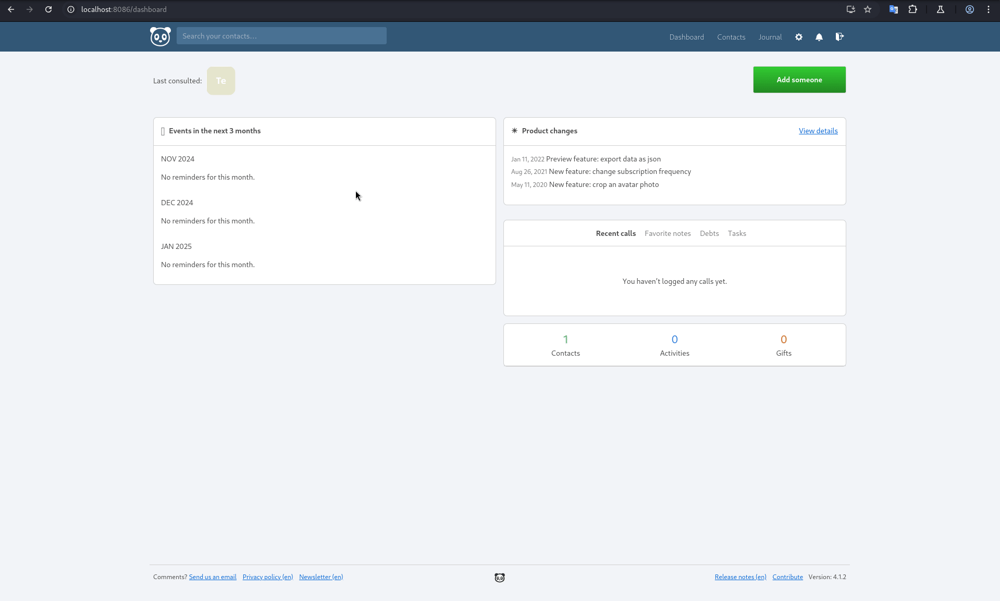

During an investigation on the application [Monica](https://hub.docker.com/_/monica), I identified 5 new CVEs in a single day. All of them are Client-Side Injection vulnerabilities leading to Stored XSS.

## CVE-2024-54994
### CSTI Leading to Stored Cross-Site Scripting (XSS)

**Description**: MonicaHQ v4.1.2 was found to contain multiple client-side injection vulnerabilities through the *first_name* and *last_name* parameters in the *Add a new relationship* function.  
**Affected Versions**: v4.1.2  
**Researcher**: [Nicolás Gula](https://www.linkedin.com/in/nicolasgula/)  
**Disclosure Link**: [GitHub](https://github.com/p314dO/CVEs/tree/main/CVE-2024-54994)  
**NIST CVE Link**: https://nvd.nist.gov/vuln/detail/CVE-2024-54994  

### Details

- MonicaHQ 4.1.2 is vulnerable to client-side template injection. An authenticated attacker can inject malicious code into the *first_name* and *last_name* parameters in the *Add a new relationship* form.
- To exploit this vulnerability, the following payload can be injected into the *first_name* and *last_name* parameters:

```
ty {{toString().constructor.constructor('alert(1)')()}}.
```


**First Case**: Enter a name in the *first_name* parameter and the payload in the *last_name* parameter.  
**Second Case**: Enter the payload in the *first_name* parameter and leave the *last_name* parameter empty.

### PoC

   


---

## CVE-2024-54996
### CSTI Leading to Stored Cross-Site Scripting (XSS)

**Description**: MonicaHQ v4.1.2 was found to contain multiple authenticated client-side injection vulnerabilities via the *title* and *description* parameters in */people/ID/reminders/create*.  
**Affected Versions**: v4.1.2  
**Researcher**: [Nicolás Gula](https://www.linkedin.com/in/nicolasgula/)  
**Disclosure Link**: [GitHub](https://github.com/p314dO/CVEs/tree/main/CVE-2024-54996)  
**NIST CVE Link**: https://nvd.nist.gov/vuln/detail/CVE-2024-54996  

### Details

- MonicaHQ 4.1.2 is vulnerable to client-side template injection. An authenticated attacker can inject malicious code into the *title* and *description* fields of the "*What would you like to be reminded of about Test?*" form within the */people/ID/reminders/create* section.
- To exploit this vulnerability, the following payload can be injected into the *title* and *description* fields:

```
ty {{toString().constructor.constructor('alert(1)')()}}.
```


### PoC


---

## CVE-2024-54997
### CSTI Leading to Stored Cross-Site Scripting (XSS)

**Description**: MonicaHQ v4.1.1 was found to contain an authenticated client-side injection vulnerability via the input text field in */journal/entries/ID/edit*.  
**Affected Versions**: v4.1.1  
**Researcher**: [Nicolás Gula](https://www.linkedin.com/in/nicolasgula/)  
**Disclosure Link**: [GitHub](https://github.com/p314dO/CVEs/tree/main/CVE-2024-54997)  
**NIST CVE Link**: https://nvd.nist.gov/vuln/detail/CVE-2024-54997  

### Details

- MonicaHQ 4.1.1 is vulnerable to client-side template injection. An authenticated attacker can inject malicious code into the *entry* field in the "*Edit a journal entry*" form within the */journal/entries/ID/edit* section.
- To exploit this vulnerability, the following payload can be injected into the *entry* field:

```
ty {{toString().constructor.constructor('alert(1)')()}}.
```


### PoC


---

## CVE-2024-54998
### CSTI Leading to Stored Cross-Site Scripting (XSS)

**Description**: MonicaHQ v4.1.2 was found to contain an authenticated client-side injection vulnerability via the *reason* parameter in */people/h:[id]/debts/create*.  
**Affected Versions**: v4.1.2  
**Researcher**: [Nicolás Gula](https://www.linkedin.com/in/nicolasgula/)  
**Disclosure Link**: [GitHub](https://github.com/p314dO/CVEs/tree/main/CVE-2024-54998)  
**NIST CVE Link**: https://nvd.nist.gov/vuln/detail/CVE-2024-54998  

### Details

- MonicaHQ 4.1.2 is vulnerable to client-side template injection. An authenticated attacker can inject malicious code into the *reason* field in the "*Add Debt*" form within the */people/h:[id]/debts/create* section.
- To exploit this vulnerability, the following payload can be injected into the *reason* field:

```
ty {{toString().constructor.constructor('alert(1)')()}}.
```

### PoC


---
## CVE-2024-54999
### CSTI Leading to Stored Cross-Site Scripting (XSS)

**Description**: MonicaHQ v4.1.2 was found to contain a client-side injection vulnerability via the *last_name* parameter in the *General Information* module.  
**Affected Versions**: v4.1.2  
**Researcher**: [Nicolás Gula](https://www.linkedin.com/in/nicolasgula/)  
**Disclosure Link**: [GitHub](https://github.com/p314dO/CVEs/tree/main/CVE-2024-54999)  
**NIST CVE Link**: https://nvd.nist.gov/vuln/detail/CVE-2024-54999  

### Details

- MonicaHQ 4.1.2 is vulnerable to client-side template injection. An authenticated attacker can inject malicious code into the *last_name* field in the "General Information" form within */settings*.
- To exploit this vulnerability, the following payload can be injected into the *last_name* field:

```
ty {{toString().constructor.constructor('alert(1)')()}}.
```
----


## References

- https://nvd.nist.gov/vuln/detail/CVE-2024-54994
- https://nvd.nist.gov/vuln/detail/CVE-2024-54996
- https://nvd.nist.gov/vuln/detail/CVE-2024-54997
- https://nvd.nist.gov/vuln/detail/CVE-2024-54998
- https://nvd.nist.gov/vuln/detail/CVE-2024-54999
- https://github.com/p314dO/CVEs/tree/main
- https://portswigger.net/research/evading-defences-using-vuejs-script-gadgets
