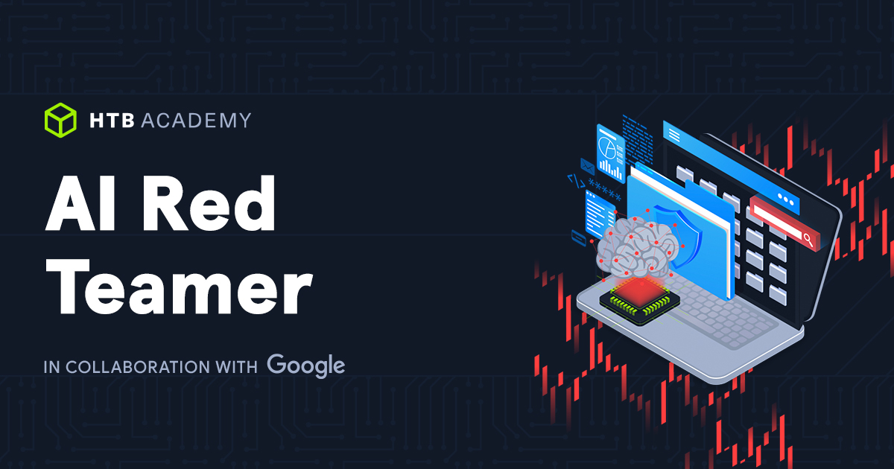

HackTheBox, en colaboracion con Google, lanzo un nuevo path para Red Teamers especializados en Inteligencia Artificial.
Este path incluye los siguiente modulos:

- `Fundamentos de la IA`: Este módulo ofrece una guía completa sobre los fundamentos teóricos de la Inteligencia Artificial (IA). Abarca diversos paradigmas de aprendizaje, incluyendo el aprendizaje supervisado, no supervisado y de refuerzo, proporcionando una sólida comprensión de los algoritmos y conceptos clave.

- `Aplicaciones de la IA en InfoSec`: Este módulo es una introducción práctica a la creación de modelos de IA aplicables a diversos ámbitos de la seguridad informática. Abarca la configuración de un entorno de IA controlado mediante Miniconda para la gestión de paquetes y JupyterLab para la experimentación interactiva. Los estudiantes aprenderán a gestionar conjuntos de datos, preprocesarlos y transformarlos, e implementar flujos de trabajo estructurados para tareas como la clasificación de spam, la detección de anomalías de red y la clasificación de malware. A lo largo del módulo, los estudiantes explorarán bibliotecas esenciales de Python como Scikit-learn y PyTorch, comprenderán enfoques eficaces para el procesamiento de conjuntos de datos y se familiarizarán con las métricas de evaluación comunes, lo que les permitirá comprender todo el ciclo de vida del desarrollo y la experimentación de modelos de IA.

- `Introducción a la IA de Red Teaming`: Este módulo ofrece una introducción completa al mundo de la Inteligencia Artificial (IA) y los sistemas que utilizan implementaciones de Aprendizaje Automático (ML) en equipos rojos. Abarca una descripción general de las vulnerabilidades de seguridad comunes en estos sistemas y los tipos de ataques que pueden lanzarse contra sus componentes.

- `Prompt Injection Attacks`: Este módulo presenta exhaustivamente uno de los ataques más comunes contra grandes modelos de lenguaje (LLM): la inyección de prompts. Presenta los fundamentos de la inyección de prompts y cubre vectores de ataque detallados basados ​​en informes de vulnerabilidades reales. Además, aborda la investigación académica en los campos de nuevas técnicas de inyección de prompts y jailbreaks.

- `Ataques a datos de IA`: Este módulo explora la intersección de los datos y la inteligencia artificial, exponiendo cómo se pueden explotar las vulnerabilidades dentro de las cadenas de datos de IA, con el objetivo final de degradar el rendimiento, lograr clasificaciones erróneas específicas o ejecutar código arbitrario.

A medida que vayan saliendo los modulos voy a ir subiendo resumenes de los temas mas importantes, para solidificar la comprension de los mismo y compartir el conocimiento.

