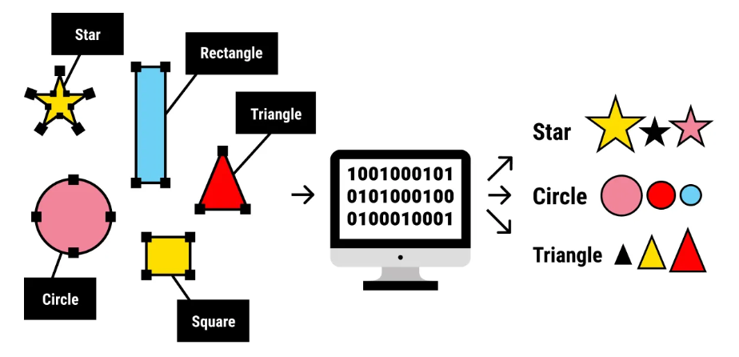

Los algoritmos de ***APRENDIZAJE SUPERVISADO*** son la piedra angular de muchas aplicaciones de Machine Learning, ya que permiten que los sistemas aprendan de datos etiquetados y realicen predicciones precisas.

## Cómo funciona el aprendizaje supervisado

Imagina que le estás enseñando a un niño a identificar diferentes frutas. Le muestras una manzana y le dices: "Esto es una manzana". Luego le muestras una naranja y le dices: "Esto es una naranja". Al presentarle ejemplos repetidamente con etiquetas, el niño aprende a distinguir las frutas según sus características, como el color, la forma y el tamaño.

Los algoritmos de aprendizaje supervisado funcionan de forma similar. Se alimentan de un gran conjunto de datos de ejemplos etiquetados y utilizan estos datos para entrenar un modelo capaz de predecir las etiquetas de ejemplos nuevos e inéditos. 

Los problemas de aprendizaje supervisado se pueden clasificar en dos tipos principales:

- `CLASIFICACION`: En los problemas de clasificación, el objetivo es predecir una etiqueta categórica. Por ejemplo, clasificar correos electrónicos como spam o no, o identificar imágenes de gatos, perros o pájaros.
- `REGRESION`: En los problemas de regresión, el objetivo es predecir un valor continuo. Por ejemplo, se podría predecir el precio de una casa según su tamaño, ubicación y otras características, o pronosticar el mercado de valores.

## Conceptos básicos del aprendizaje supervisado

Estos conceptos constituyen la base para comprender cómo los algoritmos aprenden de datos etiquetados para realizar predicciones precisas.

### Training Data
Es el conjunto de datos etiquetados que se utiliza para entrenar el modelo.

### Features
Son las propiedades o características medibles de los datos que sirven como entrada al modelo. Son las variables que el algoritmo utiliza para aprender y hacer predicciones. Seleccionar las variables relevantes featureses crucial para construir un modelo eficaz.

Por ejemplo, al predecir los precios de las viviendas, las características podrían incluir:

- Tamaño
- Número de dormitorios
- Ubicación
- Edad de la casa

### Labels
Son los resultados conocidos o variables objetivo asociadas a cada punto de datos del conjunto de entrenamiento. Representan las "respuestas correctas" que el modelo pretende predecir.
En el ejemplo de predicción del precio de la vivienda, labelsería el precio real de la vivienda.

### Model
Es una representación matemática de la relación entre las características y las etiquetas.
Puede considerarse una función que toma las características como entrada y genera una predicción para la etiqueta.

### Training
Es el proceso de alimentar el algoritmo y ajustar los parámetros del modelo para minimizar los errores de predicción. El algoritmo aprende ajustando iterativamente sus parámetros internos para mejorar la precisión de su predicción.

### Prediction
Una vez entrenado el modelo, puede utilizarse para predecir datos nuevos que no se han visto. Para ello, hay que proporcionar al modelo las características del nuevo punto de datos, y el modelo emitirá una predicción para la etiqueta. La predicción es una aplicación específica de la inferencia, centrada en la generación de resultados procesables, como la clasificación de un correo electrónico como spam o la previsión de los precios de las acciones.

### Inference
La inferencia es un concepto más amplio que abarca la predicción, pero también incluye la comprensión de la estructura y los patrones subyacentes en los datos. Implica el uso de un equipo capacitado para obtener información, estimar parámetros y comprender las relaciones entre variables.

### Evaluation
Implica evaluar el rendimiento del modelo para determinar su precisión y capacidad de generalización a nuevos datos. Las métricas de evaluación comunes incluyen:
- `Accuracy`: La proporción de predicciones correctas realizadas por el modelo.
- `Precision`: La proporción de predicciones positivas verdaderas entre todas las predicciones positivas.
- `Recall`: La proporción de predicciones positivas verdaderas entre todos los casos positivos reales.
- `F1-score`: Una media armónica de precisión y recuperación, que proporciona una medida equilibrada del rendimiento del modelo.

### Generalization
Se refiere a la capacidad del modelo para predecir con precisión los resultados de datos nuevos e inéditos que no se utilizaron durante el entrenamiento. Un modelo con buena generalización puede aplicar eficazmente el conocimiento adquirido a situaciones reales.

### Overfitting
Esto ocurre cuando un modelo aprende demasiado bien los datos de entrenamiento, incluyendo el ruido y los valores atípicos. Esto puede provocar una generalización deficiente de los nuevos datos, ya que el modelo ha memorizado el conjunto de entrenamiento en lugar de aprender los patrones subyacentes.

### Underfitting
Se produce cuando un modelo es demasiado simple para capturar los patrones subyacentes en los datos. Esto resulta en un rendimiento deficiente tanto con los datos de entrenamiento como con datos nuevos e inéditos.

### Cross-validation
Es una técnica que se utiliza para evaluar la capacidad de generalización de un modelo a un conjunto de datos independiente. Implica dividir los datos en múltiples subconjuntos (pliegues) y entrenar el modelo con diferentes combinaciones de estos pliegues, validándolo con el pliegue restante. Esto ayuda a reducir el sobreajuste y proporciona una estimación más fiable del rendimiento del modelo.

### Regularization
Es una técnica que se utiliza para evitar el sobreajuste añadiendo un término de penalización a la función de pérdida. Esta penalización impide que el modelo aprenda patrones demasiado complejos que podrían no generalizarse bien. Las técnicas de regularización más comunes incluyen:

- `L1 Regularization`: Agrega una penalización igual al valor absoluto de la magnitud de los coeficientes.
- `L2 Regularization`: Añade una penalización igual al cuadrado de la magnitud de los coeficientes.

TO BE CONTINUED . . .