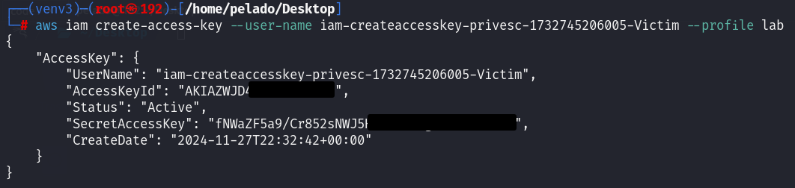

Explote `iam:CreateAccessKey` para obtener acceso a un bucket S3 de Amazon que contiene datos confidenciales a los que su usuario IAM no tiene acceso. La bandera es el número de tarjeta de crédito de "Kayla Sánchez" del archivo de clientes exfiltrados. 

## Escenario

Sólo los administradores de alto nivel deben tener el permiso `iam:CreateAccessKey` , ya que un atacante con este permiso sobre otros usuarios puede crear un Access Key ID  y una Secret Key para ese usuario, lo que significa que pueden autenticarse como ese usuario.

Aproveche la política de IAM mal configurada de este laboratorio para elevar sus privilegios.  Esta práctica de laboratorio se completa con éxito una vez que haya accedido y descargado archivos confidenciales que contienen información de identificación personal del cliente en Amazon S3 y haya enviado el número de tarjeta de crédito de "Kayla Sánchez" desde el archivo clientes.txt.

## Tutorial

Luego de configurar la CLI de AWS con las credenciales dadas, pasamos a la fase de enumeracion. Comenzamos con `sts get-caller-identity` y `iam get-user` para recuperar informacion de nuestro usuario.


Nuestro nombre de usuario es `iam-createaccesskey-privesc-1732745206005-Attacker`. Enumeramos que otros usuarios
se encuentran en la cuenta.


Encontramos que hay un usuario mas. Luego de conseguir los nombres , paso a listar mis politicas en linea y adjuntas, pero no tengo los permisos para hacerlo. 
Paso a listar los grupos que hay en esta cuenta.


Tenemos al grupo `iam-createaccesskey-privesc-1732745206005-Developers`. Y si listo los grupos a los que pertenece mi usuario, estoy dentro de ese grupo.


Al listar las politicas del grupo en linea, recuperamos su nombre y ya con este obtenemos la politica para ver los permisos que tenemos al pertenecer al grupo `iam-createaccesskey-privesc-1732745206005-Developers`.


Una de las acciones que podemos realizar y que tendra efecto en el otro usuario es `iam:create-access-key`.

Si buscamos como escalar privilegios con iam:createAccessKey encontramos dos links principales: [HacktricksCloud](https://cloud.hacktricks.xyz/pentesting-cloud/aws-security/aws-privilege-escalation/aws-iam-privesc#iam-createaccesskey)  y [RhinoSecurityLabs](https://rhinosecuritylabs.com/aws/aws-privilege-escalation-methods-mitigation/).

`iam:CreateAccessKey Permite crear una access key ID y una secret access key para otro usuario, lo que lleva a una posible escalada de privilegios.`

```bash
aws iam create-access-key --user-name <VICTIM>
```

Procedemos a ejecutar el comando escalando privilegios al usuario victima.


Configuramos con las nuevas claves que conseguimos


Comenzamos de vuelta la enumeracion


Listamos las posibles politicas en linea del usuario victima, y encontramos que tiene acceso a un bucket,
pudiendo listar y obtener lo que contiene.


Listamos los buckets que hay.


Listamos su contenido.


Copiamos y encontramos la Flag.


----

## Referencias
- [CloudTricks](https://cloud.hacktricks.xyz/pentesting-cloud/aws-security/aws-privilege-escalation/aws-iam-privesc)
- [RhinoSecurityLabs](https://rhinosecuritylabs.com/aws/aws-privilege-escalation-methods-mitigation/)
- [Laboratorio](https://cybr.com/hands-on-labs/lab/iam-createaccesskey-privesc/)