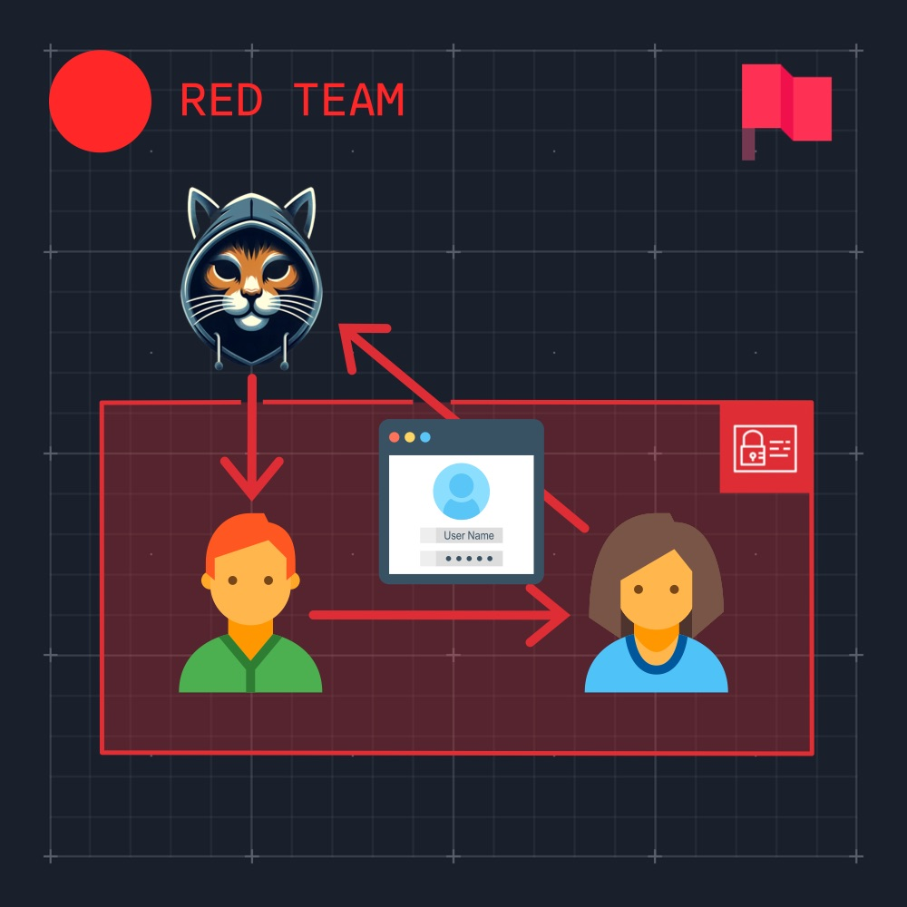
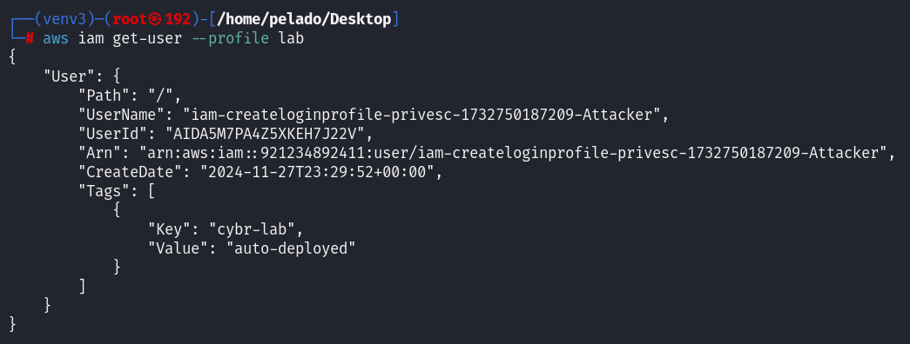
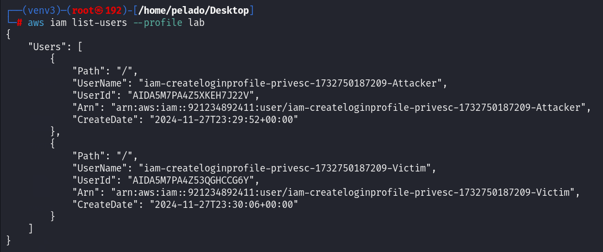
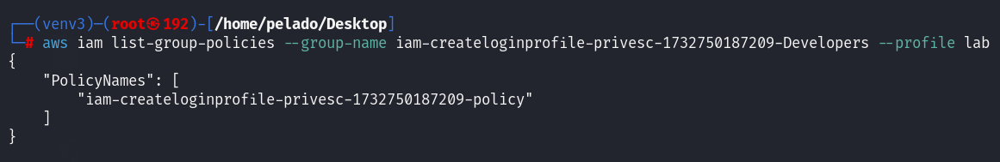
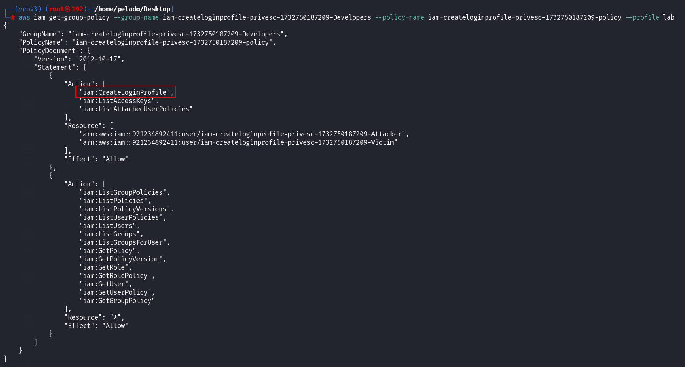
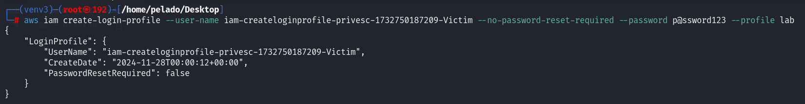
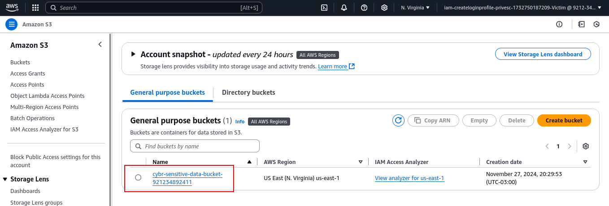
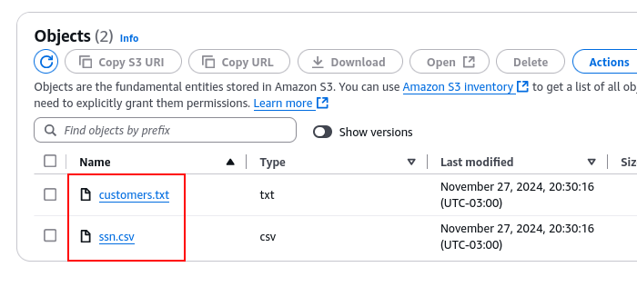
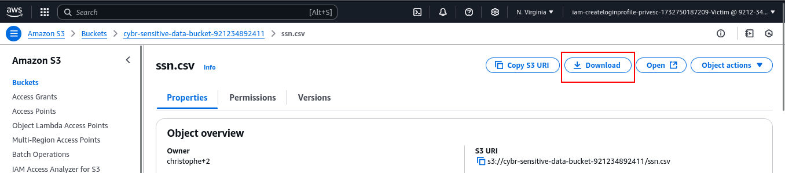
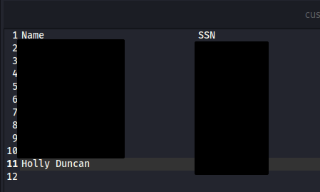

Explote iam:CreateLoginProfile para obtener acceso a un depósito de Amazon S3 que contiene datos confidenciales a los que su usuario de IAM. La bandera es el número de SSN de "Holly Duncan" del archivo "ssn.csv".

## Escenario

El objetivo de este laboratorio es explotar la vulnerabilidad `iam:CreateLoginProfile` para otorgarse permisos a los que no debería tener acceso. Ha completado con éxito esta práctica de laboratorio una vez que haya accedido y descargado archivos confidenciales que contienen información de identificación personal del cliente en Amazon S3 y haya enviado el número de SSN de "Holly Duncan".

## Tutorial

Luego de configurar la CLI de AWS con las credenciales dadas, pasamos a la fase de enumeracion. Comenzamos con `sts get-caller-identity` y `iam get-user` para recuperar informacion de nuestro usuario.




Nuestro nombre de usuario es `iam-createloginprofile-privesc-1732750187209-Attacker`. Enumeramos que otros usuarios se encuentran en la cuenta.



Encontramos que hay un usuario mas. Luego de conseguir los nombres , paso a listar mis politicas en linea y adjuntas, pero no tengo los permisos para hacerlo. Paso a listar los grupos que hay en esta cuenta.


Tenemos al grupo `iam-createloginprofile-privesc-1732750187209-Developers`. Y si listo los grupos a los que pertenece mi usuario, estoy dentro de ese grupo. 


Al listar las politicas del grupo en linea, recuperamos su nombre y ya con este obtenemos la politica para ver los permisos que tenemos al pertenecer al grupo `iam-createloginprofile-privesc-1732750187209-Developers`.





Una de las acciones que podemos realizar y que tendra efecto en el otro usuario es `iam:create-access-key`.

Si buscamos como escalar privilegios con iam:createAccessKey encontramos dos links principales: [HacktricksCloud](https://cloud.hacktricks.xyz/pentesting-cloud/aws-security/aws-privilege-escalation/aws-iam-privesc#iam-createloginprofile-or-iam-updateloginprofile) y [RhinoSecurityLabs](https://rhinosecuritylabs.com/aws/aws-privilege-escalation-methods-mitigation/).

`iam:CreateLoginProfile permite crear o actualizar un perfil de inicio de sesión, incluida la configuración de contraseñas para el inicio de sesión de la consola de AWS, lo que lleva a una escalada directa de privilegios.` 

```bash
aws iam create-login-profile --user-name target_user --no-password-reset-required --password '<password>'
```

Procedemos a ejecutar el comando, dando como nombre de usuario la de la victima y generando un password, el cual no va a requerir un reset luego de loguearnos.



Nos logueamos en la consola de AWS y el usuario victima tiene permisos de lectura y descarga en un bucket s3.







Descargamos y encontramos la bandera.



---

## Referencias
- [CloudTricks](https://cloud.hacktricks.xyz/pentesting-cloud/aws-security/aws-privilege-escalation/aws-iam-privesc#iam-createloginprofile-or-iam-updateloginprofile)
- [RhinoSecurityLabs](https://rhinosecuritylabs.com/aws/aws-privilege-escalation-methods-mitigation/)
- [Lab](https://cybr.com/courses/iam-privilege-escalation-labs/lessons/lab-ctf-iamcreateloginprofile-privesc/)