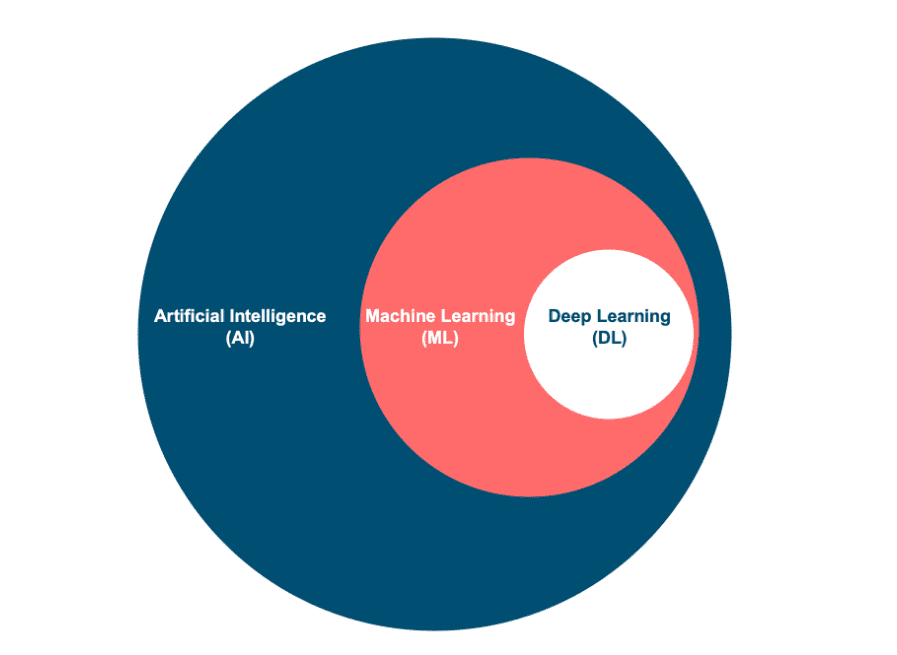
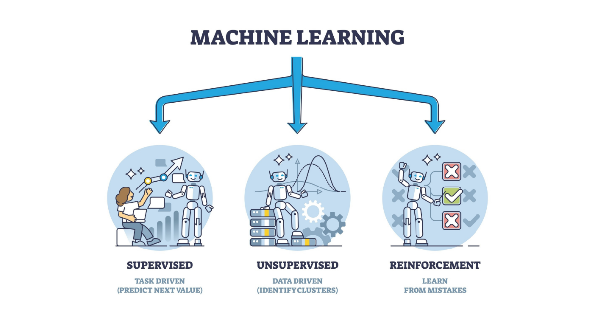

The terms Artificial Intelligence (AI) and Machine Learning (ML) are closely related, but they represent distinct concepts with specific applications and theoretical foundations.

### AI - Artificial Intelligence

AI is a broad field focused on developing intelligent systems capable of performing *tasks* that normally require human intelligence.

These tasks include:
- `Natural Language Processing`: Enabling computers to understand, interpret, and generate human language.
- `Computer Vision`: Enabling computers to “see” and interpret images and videos.
- `Robotics`: Develop robots that can perform tasks autonomously or with human guidance.
- `Expert Systems`: Create systems that mimic the decision-making capabilities of human experts.

One of the main goals of AI is to augment human capabilities, not just replace our efforts . These systems are designed to improve decision-making and our productivity , providing support in complex data analysis, 
prediction, and mechanical tasks. 

AI solves complex problems in various fields:

- In the [healthcare sector](https://www.youtube.com/watch?v=uvqDTbusdUU)  , it improves disease diagnosis and drug discovery.
- In  [finance](https://youtu.be/PjSAmUMxkrs)  , detects fraudulent transactions, and optimizes investment strategies.
- In  [cybersecurity](https://www.youtube.com/watch?v=YWGZ12ohMJU) , identifies and mitigates cyber threats.

### ML - Machine Learning

Machine learning is a subfield of AI that focuses on enabling systems to learn from data and improve their performance on specific tasks without the need for explicit programming.

ML algorithms use statistical techniques to identify patterns, trends, and anomalies in data sets, enabling the system to make predictions, decisions, or classifications based on new input data. 

ML can be classified into three main types:

- `Supervised Learning`: El algoritmo aprende de datos etiquetados, donde cada punto de datos está asociado a un resultado o etiqueta conocida. Algunos ejemplos incluyen:a
    - Clasificación de imágenes
    - Detección de spam
    - Prevención del fraude
- `Unsupervised Learning`: El algoritmo aprende de datos sin etiquetar sin proporcionar un resultado ni una etiqueta. Algunos ejemplos incluyen:
    - Segmentación de clientes
    - Detección de anomalías
    - Reducción de la dimensionalidad
- `Reinforcement Learning`: El algoritmo aprende mediante ensayo y error, interactuando con el entorno y recibiendo retroalimentación en forma de recompensas o penalizaciones. Algunos ejemplos son:
    - [Juego de juego](https://youtu.be/DmQ4Dqxs0HI)
    - [Robótica](https://www.youtube.com/watch?v=K-wIZuAA3EY)
    - [Conducción autónoma](https://www.youtube.com/watch?v=OopTOjnD3qY)
    

El aprendizaje automático tiene una amplia gama de aplicaciones en diversas industrias, entre las que se incluyen:

- `Salud`: Diagnóstico de enfermedades, descubrimiento de fármacos, medicina personalizada
- `Finanzas`: Detección de fraude, evaluación de riesgos, comercio algorítmico
- `Marketing`: Segmentación de clientes, publicidad dirigida, sistemas de recomendación
- `Ciberseguridad`: Detección de amenazas, prevención de intrusiones, análisis de malware
- `Transporte`: Predicción de tráfico, vehículos autónomos, optimización de rutas

El aprendizaje automático (ML) es un campo en rápida evolución con la aparición de nuevos algoritmos, técnicas y aplicaciones. Es un factor clave para la IA, ya que proporciona las capacidades de aprendizaje y  adaptación que sustentan muchos sistemas inteligentes.

## DL - Deep Learning

Deep Learning(DL) es un subcampo del Machine Learning que utiliza redes neuronales multicapa para aprender y extraer características de datos complejos. Estas redes 
neuronales profundas pueden identificar automáticamente patrones y representaciones intrincadas dentro de grandes conjuntos de datos, lo que las hace especialmente eficaces para tareas que involucran datos no estructurados o de alta dimensión, como imágenes, audio y texto. 

Caracteristicas claves:
- `Hierarchical Feature Learning`: Los modelos de Deep Learning pueden aprender representaciones jerárquicas de datos, donde cada capa captura características cada vez más abstractas. Por ejemplo, las *capas inferiores* pueden *detectar bordes y texturas* en el
reconocimiento de imágenes, mientras que las *capas superiores* identifican estructuras más complejas, como *formas y objetos*.
- `End-to-End Learning`: Los modelos DL se pueden entrenar de extremo a extremo, lo que significa que pueden asignar directamente datos de entrada sin procesar a las salidas deseadas sin ingeniería de características manual.
- `Scalability`: Los modelos DL pueden escalar bien con grandes conjuntos de datos y recursos computacionales, lo que los hace adecuados para aplicaciones de big data.

Tipos comunes de redes neuronales utilizadas en DL:
- `Convolutional Neural Networks`(`CNNs`): Especializadas en datos de imágenes y vídeos, las CNN utilizan capas convolucionales para detectar patrones locales y jerarquías espaciales.
- `Recurrent Neural Networks`(`RNNs`): Diseñadas para datos secuenciales como texto y voz, las RNN tienen bucles que permiten que la información persista a lo largo del tiempo.
- `Transformers`: Los transformadores, un avance reciente en aprendizaje automático (DL), son particularmente eficaces para tareas de procesamiento del lenguaje natural. Aprovechan mecanismos de autoatención para gestionar dependencias de largo alcance.

## Relación entre IA, ML y DL

El `Machine Learning`(`ML`) y `Deep Learning`(`DL`) son subcampos de `Artificial Intelligence`(`AI`) que permiten que los sistemas aprendan de los datos y tomen decisiones inteligentes. Son facilitadores cruciales de `AI`, proporcionando las capacidades de aprendizaje y adaptación que sustentan muchos sistemas inteligentes. 

Los algoritmos de *Machine Learning* (ML), incluidos los algoritmos de *Deep Learning* (DL), permiten que las máquinas aprendan de los datos, reconozcan patrones y tomen decisiones. Los distintos tipos de ML —como el aprendizaje supervisado, no supervisado y por refuerzo— contribuyen cada uno al logro de los objetivos más amplios de la inteligencia artificial (AI). Por ejemplo:

- En ***Computer Vision***, los algoritmos de aprendizaje supervisado y las redes neuronales convolucionales profundas (CNN) permiten que las máquinas “vean” e interpreten imágenes con precisión.
- En ***Natural Language Processing** (NLP*), los algoritmos tradicionales de ML y los modelos avanzados de DL, como los *transformers*, permiten comprender y generar lenguaje humano, habilitando aplicaciones como chatbots y servicios de traducción.

El DL ha mejorado significativamente las capacidades del ML al proporcionar herramientas potentes para la extracción de características y el aprendizaje de representaciones, especialmente en dominios con datos complejos y no estructurados.

La sinergia entre ML, DL y AI se evidencia en sus esfuerzos conjuntos por resolver problemas complejos. Por ejemplo:

- En **conducción autónoma**, la combinación de técnicas de ML y DL permite procesar datos de sensores, reconocer objetos y tomar decisiones en tiempo real, lo que permite a los vehículos navegar de forma segura.
- En **robótica**, los algoritmos de aprendizaje por refuerzo, a menudo mejorados con DL, entrenan robots para realizar tareas complejas en entornos dinámicos.

ML y DL impulsan la capacidad de la AI para aprender, adaptarse y evolucionar, promoviendo el progreso en diversos campos y mejorando las capacidades humanas. La sinergia entre estas disciplinas es fundamental para expandir las fronteras de la inteligencia artificial y desbloquear nuevos niveles de innovación y productividad.