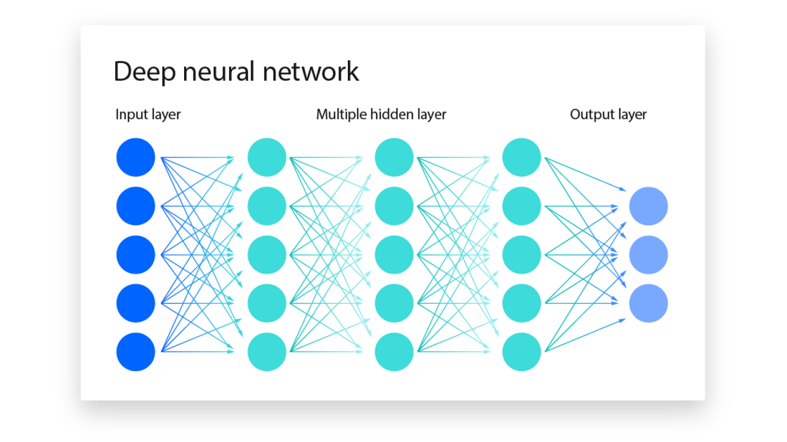

Los términos Inteligencia Artificial (AI) y Aprendizaje Automático o de Máquina (Machine Learning, ML) están estrechamente relacionados, pero representan conceptos distintos, con aplicaciones y fundamentos teóricos específicos.

### AI - Inteligencia Artificial

La AI es un campo amplio centrado en desarrollar sistemas inteligentes capaces de realizar *tareas* que normalmente requieren inteligencia humana.

Estas tareas incluyen:

* `Procesamiento de Lenguaje Natural (NLP)`: Permite a las computadoras entender, interpretar y generar lenguaje humano.
* `Visión por Computador`: Permite a las computadoras “ver” e interpretar imágenes y videos.
* `Robótica`: Desarrollar robots que puedan realizar tareas de forma autónoma o con guía humana.
* `Sistemas Expertos`: Crear sistemas que imiten las capacidades de toma de decisiones de expertos humanos.

Uno de los objetivos principales de la AI es aumentar las capacidades humanas, no solo reemplazar nuestros esfuerzos. Estos sistemas están diseñados para mejorar la toma de decisiones y la productividad, brindando apoyo en análisis de datos complejos, predicción y tareas mecánicas.

La AI resuelve problemas complejos en diversos campos:

* En el [sector salud](https://www.youtube.com/watch?v=uvqDTbusdUU), mejora el diagnóstico de enfermedades y el descubrimiento de fármacos.
* En [finanzas](https://youtu.be/PjSAmUMxkrs), detecta transacciones fraudulentas y optimiza estrategias de inversión.
* En [ciberseguridad](https://www.youtube.com/watch?v=YWGZ12ohMJU), identifica y mitiga ciberamenazas.

### ML - Machine Learning (Aprendizaje Automático)

El ML es un subcampo de la AI que se enfoca en permitir que los sistemas aprendan a partir de datos y mejoren su desempeño en tareas específicas sin necesidad de programación explícita.

Los algoritmos de ML emplean técnicas estadísticas para identificar patrones, tendencias y anomalías en conjuntos de datos, lo que permite al sistema realizar predicciones, decisiones o clasificaciones basadas en nuevos datos de entrada.

El ML puede clasificarse en tres tipos principales:

* `Aprendizaje Supervisado`: El algoritmo aprende de datos etiquetados, donde cada punto de datos está asociado a un resultado o etiqueta conocida. Ejemplos:

  * Clasificación de imágenes
  * Detección de spam
  * Prevención de fraude
* `Aprendizaje No Supervisado`: El algoritmo aprende de datos sin etiquetar, sin proporcionar un resultado ni etiqueta. Ejemplos:

  * Segmentación de clientes
  * Detección de anomalías
  * Reducción de dimensionalidad
* `Aprendizaje por Refuerzo`: El algoritmo aprende por prueba y error, interactuando con el entorno y recibiendo retroalimentación en forma de recompensas o penalizaciones. Ejemplos:

  * [Juego de juegos](https://youtu.be/DmQ4Dqxs0HI)
  * [Robótica](https://www.youtube.com/watch?v=K-wIZuAA3EY)
  * [Conducción autónoma](https://www.youtube.com/watch?v=OopTOjnD3qY)

El aprendizaje automático tiene una amplia gama de aplicaciones en diversas industrias, entre ellas:

* `Salud`: Diagnóstico de enfermedades, descubrimiento de fármacos, medicina personalizada
* `Finanzas`: Detección de fraude, evaluación de riesgos, trading algorítmico
* `Marketing`: Segmentación de clientes, publicidad dirigida, sistemas de recomendación
* `Ciberseguridad`: Detección de amenazas, prevención de intrusiones, análisis de malware
* `Transporte`: Predicción de tráfico, vehículos autónomos, optimización de rutas

El Aprendizaje Automático (ML) es un campo en rápida evolución con la aparición de nuevos algoritmos, técnicas y aplicaciones. Es un habilitador clave de la AI, ya que proporciona las capacidades de *aprendizaje* y *adaptación* que sustentan muchos sistemas inteligentes.

## DL - Deep Learning (Aprendizaje Profundo)

El Deep Learning (DL) es un subcampo del ML que utiliza redes neuronales de múltiples capas para aprender y extraer características de datos complejos. Estas redes neuronales profundas pueden identificar automáticamente patrones y representaciones intrincadas dentro de grandes conjuntos de datos, lo que las hace especialmente eficaces para tareas que involucran datos no estructurados o de alta dimensión, como imágenes, audio y texto.

Características clave:

* `Aprendizaje Jerárquico de Características`: Los modelos de DL pueden aprender representaciones jerárquicas de los datos, donde cada capa captura características cada vez más abstractas. Por ejemplo, las *capas inferiores* pueden *detectar bordes y texturas* en reconocimiento de imágenes, mientras que las *capas superiores* identifican estructuras más complejas como *formas y objetos*.
* `Aprendizaje de Extremo a Extremo`: Los modelos de DL pueden entrenarse de extremo a extremo, asignando datos de entrada sin procesar directamente a las salidas deseadas sin ingeniería manual de características.
* `Escalabilidad`: Los modelos de DL escalan bien con grandes conjuntos de datos y recursos computacionales, por lo que son adecuados para aplicaciones de big data.

Tipos comunes de redes neuronales usadas en DL:

* `Redes Neuronales Convolucionales` (`CNNs`): Especializadas en datos de imagen y video; usan capas convolucionales para detectar patrones locales y jerarquías espaciales.
* `Redes Neuronales Recurrentes` (`RNNs`): Diseñadas para datos secuenciales como texto y voz; sus bucles permiten que la información persista a lo largo del tiempo.
* `Transformers`: Un avance reciente en ML/DL, particularmente eficaces para tareas de procesamiento del lenguaje natural; aprovechan mecanismos de autoatención para manejar dependencias de largo alcance.

## Relación entre AI, ML y DL

`Machine Learning` (`ML`) y `Deep Learning` (`DL`) son subcampos de la `Artificial Intelligence` (`AI`) que permiten que los sistemas aprendan de los datos y tomen decisiones inteligentes. Son habilitadores cruciales de la `AI`, ya que proporcionan las capacidades de aprendizaje y adaptación que sustentan muchos sistemas inteligentes.

Los algoritmos de *ML*, incluidos los de *DL*, permiten que las máquinas aprendan de los datos, reconozcan patrones y tomen decisiones. Los distintos tipos de ML —supervisado, no supervisado y por refuerzo— contribuyen cada uno al logro de los objetivos más amplios de la AI. Por ejemplo:

* En ***Computer Vision***, los algoritmos supervisados y las redes neuronales convolucionales profundas (CNN) permiten que las máquinas “vean” e interpreten imágenes con precisión.
* En ***Natural Language Processing** (NLP*), los algoritmos tradicionales de ML y los modelos avanzados de DL, como los *transformers*, habilitan la comprensión y generación de lenguaje humano, impulsando aplicaciones como chatbots y servicios de traducción.

El DL ha mejorado significativamente las capacidades del ML al proporcionar herramientas potentes para la extracción de características y el aprendizaje de representaciones, especialmente en dominios con datos complejos y no estructurados.

La sinergia entre ML, DL y AI se evidencia en sus esfuerzos conjuntos por resolver problemas complejos. Por ejemplo:

* En **conducción autónoma**, la combinación de técnicas de ML y DL permite procesar datos de sensores, reconocer objetos y tomar decisiones en tiempo real, posibilitando una navegación segura.
* En **robótica**, los algoritmos de aprendizaje por refuerzo, a menudo potenciados con DL, entrenan robots para ejecutar tareas complejas en entornos dinámicos.

ML y DL impulsan la capacidad de la AI para aprender, adaptarse y evolucionar, promoviendo el progreso en diversos campos y mejorando las capacidades humanas. La sinergia entre estas disciplinas es fundamental para expandir las fronteras de la inteligencia artificial y desbloquear nuevos niveles de innovación y productividad.
