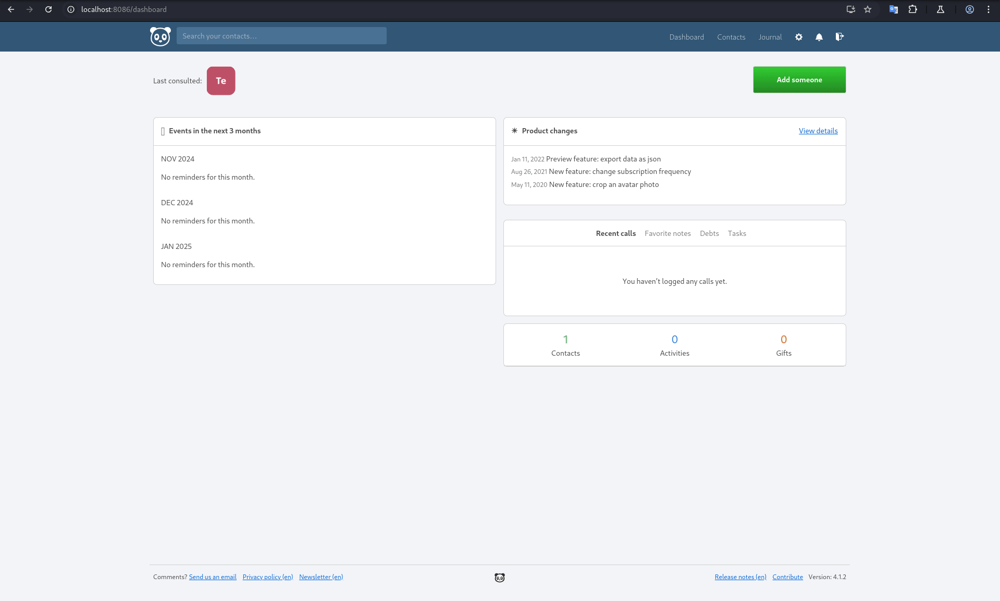

Durante una investigacion sobre la aplicacion [monica](https://hub.docker.com/_/monica), identifique 5 nuevos CVE en un dia. Todas son Client-Side Injection conduciendo a Stored XSS.

## CVE-2024-54994
### CSTI que conduce a Stored Cross-Site Scripting(XSS)

**Descripción**: Se descubrió que MonicaHQ v4.1.2 contiene múltiples vulnerabilidades de inyección del lado del cliente a través de los parámetros *first_name* y *last_name* en la función *Add a new relationship*.  
**Versiones afectadas**: v4.1.2  
**Researcher**: [Nicolas Gula](https://www.linkedin.com/in/nicolasgula/)  
**Enlace de divulgación**: [Github](https://github.com/p314dO/CVEs/tree/main/CVE-2024-54994)  
**Enlace NIST CVE**: https://nvd.nist.gov/vuln/detail/CVE-2024-54994 

### Descripcion

- MonicaHQ 4.1.2 es vulnerable a la inyección de plantilla del lado del cliente. Un atacante autenticado puede inyectar código malicioso en los parámetros *first_name* y *last_name* en el formulario *Add a new relationship*.
- Para explotar esta vulnerabilidad, se puede colocar la siguiente carga útil en los parámetros *first_name* y *last_name* : 

```
ty {{toString().constructor.constructor('alert(1)')()}}. 
```

**Primer caso**: Ingrese un nombre en el parámetro *first_name* y la carga útil en el parámetro *last_name*.  
**Segundo caso**: Ingrese la carga útil en el parámetro *first_name* y deje el parámetro *last_name* vacío. 

### PoC

   


---

## CVE-2024-54996
### CSTI que conduce a Stored Cross-Site Scripting(XSS)

**Descripción**: Se descubrió que MonicaHQ v4.1.2 contiene múltiples vulnerabilidades de inyección del lado del cliente autenticadas a través de los parámetros de *title* y *description* en */people/ID/reminders/create*.  
**Versiones afectadas**: v4.1.2  
**Researcher**: [Nicolas Gula](https://www.linkedin.com/in/nicolasgula/)  
**Enlace de divulgación**: [Github](https://github.com/p314dO/CVEs/tree/main/CVE-2024-54996)  
**Enlace NIST CVE**: https://nvd.nist.gov/vuln/detail/CVE-2024-54996

### Descripcion

- MonicaHQ 4.1.2 es vulnerable a la inyección de plantillas del lado del cliente. Un atacante autenticado puede inyectar código malicioso en los campos *title*  y *description* del formulario "*What would you like to be reminded of about Test?*"  dentro de la seccion */people/ID/reminders/create*. 
- Para explotar esta vulnerabilidad, se puede inyectar la siguiente carga útil en el title y description campo: 

```
ty {{toString().constructor.constructor('alert(1)')()}}. 
```

### PoC


---

## CVE-2024-54997
### CSTI que conduce a Stored Cross-Site Scripting(XSS)

**Descripción**: Se descubrió que MonicaHQ v4.1.1 contiene una vulnerabilidad de inyección del lado del cliente autenticada a través del campo de texto de entrada en */journal/entries/ID/edit*.  
**Versiones afectadas**: v4.1.1  
**Researcher**: [Nicolas Gula](https://www.linkedin.com/in/nicolasgula/)  
**Enlace de divulgación**: [Github](https://github.com/p314dO/CVEs/tree/main/CVE-2024-54997)  
**Enlace NIST CVE**: https://nvd.nist.gov/vuln/detail/CVE-2024-54997

### Descripcion

- MonicaHQ 4.1.1 es vulnerable a la inyección de plantillas del lado del cliente. Un atacante autenticado puede inyectar código malicioso en el *entry* campo en el formulario "*Edit a journal entry*" dentro de la sección */journal/entries/ID/edit*. 
- Para explotar esta vulnerabilidad, se puede inyectar la siguiente carga útil en el *entry* campo: 

```
ty {{toString().constructor.constructor('alert(1)')()}}.  
```

### PoC


---

## CVE-2024-54998
### CSTI que conduce a Stored Cross-Site Scripting(XSS)

**Descripción**: Se descubrió que MonicaHQ v4.1.2 contenía una vulnerabilidad de inyección del lado del cliente autenticada a través del parámetro *Reason* en */people/h:[id]/debts/create*.  
**Versiones afectadas**: v4.1.2  
**Researcher**: [Nicolas Gula](https://www.linkedin.com/in/nicolasgula/)  
**Enlace de divulgación**: [Github](https://github.com/p314dO/CVEs/tree/main/CVE-2024-54998)  
**Enlace NIST CVE**: https://nvd.nist.gov/vuln/detail/CVE-2024-54998

### Descripcion

- MonicaHQ 4.1.2 es vulnerable a la inyección de plantillas del lado del cliente. Un atacante autenticado puede inyectar código malicioso en el reason campo en el formulario "*Add Debt*" dentro del */people/h:[id]/debts/create* sección. 
- Para explotar esta vulnerabilidad, se puede inyectar la siguiente carga útil en el campo *reason*: 

```
ty {{toString().constructor.constructor('alert(1)')()}}.  
```

### PoC


---

## CVE-2024-54999
### CSTI que conduce a Stored Cross-Site Scripting(XSS)

**Descripción**: Se descubrió que MonicaHQ v4.1.2 contiene una vulnerabilidad de inyección del lado del cliente a través del parámetro *last_name* del módulo de *General Information*.  
**Versiones afectadas**: v4.1.2  
**Researcher**: [Nicolas Gula](https://www.linkedin.com/in/nicolasgula/)  
**Enlace de divulgación**: [Github](https://github.com/p314dO/CVEs/tree/main/CVE-2024-54999)  
**Enlace NIST CVE**: https://nvd.nist.gov/vuln/detail/CVE-2024-54999

### Descripcion

- MonicaHQ 4.1.2 es vulnerable a la inyección de plantillas del lado del cliente. Un atacante autenticado puede inyectar código malicioso en el campo *last_name* en el formulario "General Information" dentro del */settings*
- Para explotar esta vulnerabilidad, se puede inyectar la siguiente carga útil en el *last_name* campo: 

```
ty {{toString().constructor.constructor('alert(1)')()}}.  
```

### PoC


---- 


----

## Referencias

- https://nvd.nist.gov/vuln/detail/CVE-2024-54994
- https://nvd.nist.gov/vuln/detail/CVE-2024-54996
- https://nvd.nist.gov/vuln/detail/CVE-2024-54997
- https://nvd.nist.gov/vuln/detail/CVE-2024-54998
- https://nvd.nist.gov/vuln/detail/CVE-2024-54999
- https://github.com/p314dO/CVEs/tree/main
- https://portswigger.net/research/evading-defences-using-vuejs-script-gadgets