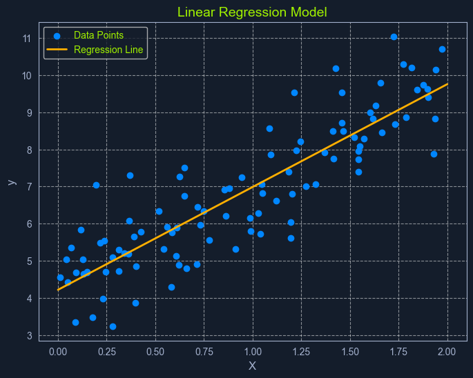
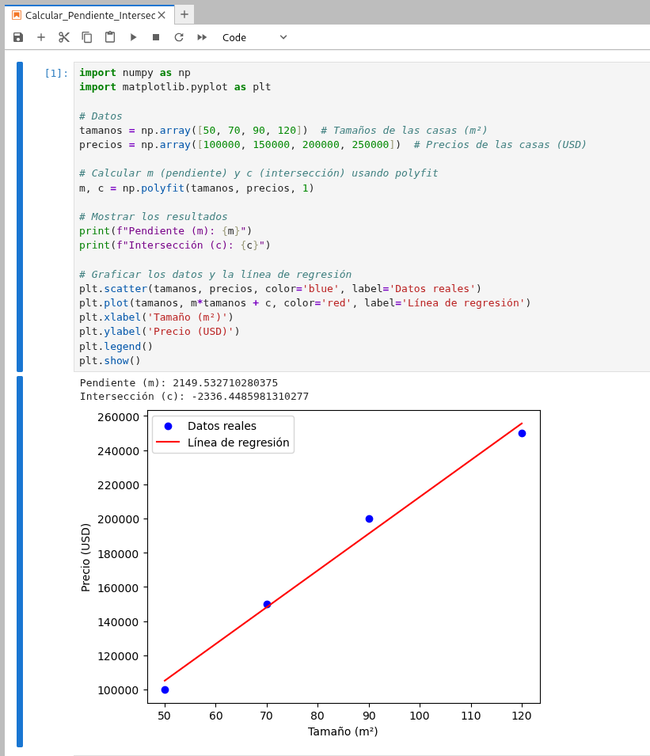
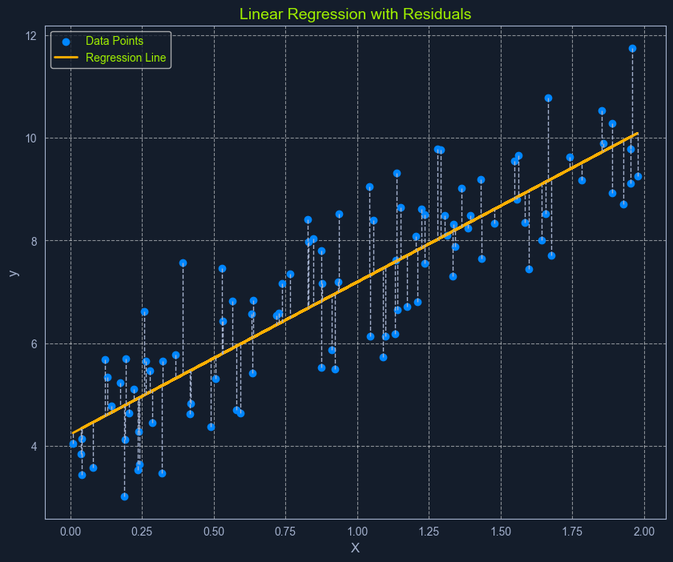

La regresión lineal es un algoritmo de **aprendizaje supervisado** que se usa para predecir un valor **continuo** (como el precio de algo) basado en una o más características (como el tamaño de una casa). Lo hace creando una **relación lineal** entre el valor que queremos predecir (el precio) y las características que usamos para predecirlo (el tamaño de la casa).

Imagina que quieres saber cuánto costaría una casa dependiendo de su tamaño. La regresión lineal intenta encontrar una línea recta que muestre cómo cambia el precio de la casa según el tamaño. Por ejemplo, a medida que el tamaño de la casa crece, el precio suele aumentar. El objetivo del algoritmo es encontrar la **mejor línea** que se ajuste a los datos y minimice los errores al predecir el precio.

Es como trazar una línea que pase lo más cerca posible de todos los puntos en un gráfico, donde cada punto representa el precio y el tamaño de una casa. Con esta línea, podemos predecir el precio de una casa si conocemos su tamaño.


## REGRESION

Antes de hablar en detalle sobre la regresión lineal, es importante entender el concepto general de **regresión** en el aprendizaje automático. La regresión es un tipo de **aprendizaje supervisado** que se usa para predecir un valor **continuo**. Esto significa que el valor que queremos predecir puede ser cualquier número dentro de un rango específico.

A diferencia de otros algoritmos, como los de **clasificación**, que asignan una categoría a algo (como decidir si un correo es "spam" o "no es spam"), la regresión se centra en predecir **números**.

Algunos ejemplos de problemas de regresión incluyen:

* Predecir el **precio de una casa** según su tamaño, ubicación y antigüedad.
* Predecir la **temperatura diaria** basándose en datos de clima pasados.
* Estimar cuántas **visitas** tendrá un sitio web según el dinero gastado en marketing y la época del año.

En estos ejemplos, el objetivo es predecir un valor numérico, lo cual es diferente a los problemas de clasificación, donde el resultado es una categoría o etiqueta (como "sí" o "no").

La **Regresion Lineal** se trata simplemente de un tipo específico de análisis de regresión en el que asumimos una relación lineal entre las variables predictoras y la variable objetivo. Esto significa que intentamos modelar la relación mediante una línea recta.

## REGRESION LINEAL SIMPLE

En su forma más simple, la regresión lineal simple involucra dos cosas: una variable predictora y una variable objetivo. La ecuación que se utiliza para representar la relación entre ellas es una línea recta:

```
y = mx + c
```

Donde:
- `y` es el valor que queremos predecir (la variable objetivo).
- `x` es la variable que usamos para hacer la predicción (la variable predictora).
- `m` es la pendiente de la línea, que muestra cómo cambia y cuando x cambia. Es decir, cuánto aumenta o disminuye y cuando cambia x.
- `c` es el valor donde la línea corta el eje y, es decir, el valor de y cuando x es igual a 0.
Piensa en la ecuación como una regla para predecir un número (y) basándote en otro número (x).

## EJEMPLO DE LA VIDA REAL


Imagina que quieres predecir el precio de una casa basándote en su tamaño (en metros cuadrados). Tienes algunos datos históricos sobre casas, que te dicen el tamaño y el precio. Ahora, vamos a usar la fórmula de regresión lineal simple para encontrar la relación entre el tamaño de la casa (variable predictora, x) y el precio (variable objetivo, y).

Supongamos que tienes estos datos:

| Tamaño (m²) | Precio (USD) |
|-------------|--------------|
| 50          | 100,000      |
| 70          | 150,000      |
| 90          | 200,000      |
| 120         | 250,000      |

### Paso 1: La fórmula de la regresión lineal
La fórmula es:

```
y = mx + c
```

Donde:
- `y` es el precio de la casa (lo que queremos predecir).
- `x` es el tamaño de la casa.
- `m` es la pendiente de la línea, que muestra cómo cambia el precio cuando cambia el tamaño.
- `c` es el valor del precio cuando el tamaño es 0 (la intersección con el eje y).

### Paso 2: Calcular la pendiente (m) y la intersección (c)
Para calcular m y c, normalmente usaríamos el método de Mínimos Cuadrados Ordinarios (MCO), pero en lugar de hacer todos los cálculos manualmente, vamos a obtener los valores aproximados de m y c usando Python.

Podemos usar la librería NumPy, que tiene una función conveniente llamada [polyfit()](https://medium.com/@heyamit10/how-to-use-numpy-polyfit-method-in-numpy-870bb82242dc) para ajustar una recta a los datos. 

```python
import numpy as np
import matplotlib.pyplot as plt

# Datos
tamanos = np.array([50, 70, 90, 120])  # Tamaños de las casas (m²)
precios = np.array([100000, 150000, 200000, 250000])  # Precios de las casas (USD)

# Calcular m (pendiente) y c (intersección) usando polyfit
m, c = np.polyfit(tamanos, precios, 1)

# Mostrar los resultados
print(f"Pendiente (m): {m}")
print(f"Intersección (c): {c}")

# Graficar los datos y la línea de regresión
plt.scatter(tamanos, precios, color='blue', label='Datos reales')
plt.plot(tamanos, m*tamanos + c, color='red', label='Línea de regresión')
plt.xlabel('Tamaño (m²)')
plt.ylabel('Precio (USD)')
plt.legend()
plt.show()
```

Explicación del código:
- `Datos`: Se almacenan en las variables tamanos (tamaño de las casas) y precios (precio de las casas).
- `np.polyfit()`: Esta función ajusta una línea (de grado 1, que es una línea recta) a los datos. El primer parámetro son los tamaños (x), el segundo los precios (y), y el 1 al final indica que estamos buscando una relación lineal.
- `Resultados`: El valor de m (pendiente) y c (intersección) se calculan y se imprimen en la consola.
- `Gráfico`: Finalmente, graficamos los puntos reales (en azul) y la línea de regresión calculada (en rojo).




**Pendiente (m): 2149.53**: significa que por cada metro cuadrado adicional, el precio de la casa aumenta en 2149.53 USD.  
**Intersección (c): -2336.45**: es el valor que la ecuación predice para el precio cuando el tamaño de la casa es 0 m², aunque este valor no tiene sentido práctico en este caso.

### Paso 3: Hacer una predicción
Supongamos que queremos predecir el precio de una casa de 80 m² usando la nueva ecuación.

1. **Tamaño de la casa (x) = 80 m²**.
2. Sustituimos en la ecuación **y = 2149.53 * x - 2336.45**.

y = 2149.53 * 80 - 2336.45  
y = 171962.4 - 2336.45  
y = 169625.95

Por lo tanto, según el modelo de regresión lineal ajustado, el precio estimado de una casa de **80 m²** sería **169,625.95 USD**.
Este es el resultado utilizando los valores calculados con el método de Mínimos Cuadrados Ordinarios (MCO).

## REGRESION LINEAL MULTIPLE

Se denomina asi cuando intervienen múltiples variables predictoras.
```
y = b0 + b1x1 + b2x2 + ... + bnxn
```

Dónde:
- `y` es la variable objetivo prevista
- `x1, x2, ..., xn` son las variables predictoras
- `b0` es la intersección con el eje `y`
- `b1, b2, ..., bn` son los coeficientes que representan la relación entre cada variable predictora y la variable objetivo.

## MINIMOS CUADRADOS ORDINARIOS


La regresión lineal usa un método llamado Mínimos Cuadrados Ordinarios (MCO) para encontrar los mejores valores para los coeficientes de la línea de regresión. Su objetivo es ajustar la línea de manera que el error total entre los valores predichos y los valores reales sea lo más pequeño posible.

1. Calcular los residuos
Para cada punto de datos, calculamos la diferencia entre el valor real (lo que realmente pasó) y el valor predicho por el modelo (lo que esperamos que pase).

2. Elevar los residuos al cuadrado
Elevamos al cuadrado cada diferencia para que todos los valores sean positivos. Además, esto le da más peso a los errores grandes (es decir, a las predicciones que se alejan mucho de la realidad).

3. Sumar los residuos cuadrados
Sumamos todos los residuos al cuadrado para obtener un solo número que representa el error total del modelo. Este número se llama Suma de los Cuadrados de los Residuos (RSS).

4. Minimizar la suma de los residuos cuadrados
El algoritmo ajusta los valores de los coeficientes para hacer que esta suma (RSS) sea lo más pequeña posible. Al hacer esto, encontramos la mejor línea que describe los datos.

Este proceso es como buscar la línea que minimiza el área total de los cuadrados entre los puntos de datos y la línea de regresión.

## Supuestos de la regresión lineal 
Para que los resultados de la regresión lineal sean confiables, se deben cumplir varios supuestos sobre los datos:

`Linealidad`: Debe haber una relación lineal entre las variables que estamos analizando. Es decir, los cambios en la variable predictora deben estar relacionados de manera directa y proporcional con los cambios en la variable objetivo.

`Independencia`: Cada punto de datos debe ser independiente de los demás. No debe haber una relación entre los puntos de datos (por ejemplo, si estás prediciendo algo en el tiempo, como las ventas diarias, los datos de un día no deben depender de los del día anterior).

`Homoscedasticidad`: La dispersión de los errores (o residuos) debe ser constante en todo el rango de valores. En otras palabras, los errores no deben aumentar o disminuir a medida que cambian los valores de la variable predictora.

`Normalidad`: Los errores deben seguir una distribución normal. Esto es importante para realizar inferencias válidas sobre los coeficientes del modelo.

¿Por qué son importantes estos supuestos?  
Si los supuestos no se cumplen, las predicciones del modelo podrían ser inexactas o engañosas. Evaluar estos supuestos antes de aplicar la regresión lineal asegura que el modelo sea válido y fiable.